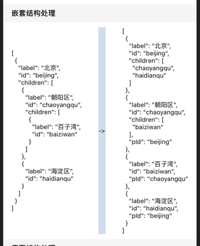
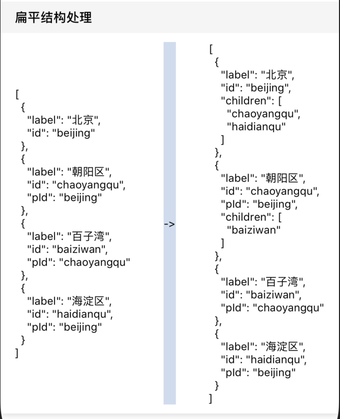

# Tree 树形结构处理

树形结构有两种表示方法：子表表示法（嵌套）和父指针表示法（扁平）。

Tree 将两者进行了整合，输出一个扁平的结构，一个节点既通过 pId（指向父节点的唯一标志）建立与父节点关系，又通过 children（数组，存储子节点的唯一标志）建立与子节点的关系。

一个树形结构，为了方便处理，通常需要具备以下特点：

- 一个扁平的数组结构很重要，在需要获取某个节点时，可以仅通过一次循环快速找到该节点。Tree 输出的结果是一个扁平的结构。
- 每个节点需要有唯一标志。在数据源没有唯一标志时，Tree 会自动生成。
- 不可变数据更新。Tree 内部使用不可变数据更新，不会影响原始数据。

## Usage

只支持按需引入。

```js
import Tree from '@roo/roo-mobile-rn/dist/common/utils/Tree'
```

## Examples





## Code
[详细 Code](../../examples/common/TreeScreen/index.tsx)

```js
import Tree from '@roo/roo-mobile-rn/dist/common/utils/Tree'

const treeData = new Tree({
  type: 'nested',
  idKey: 'id',
  pIdKey: 'pId',
  childrenKey: 'children'
  data: [
    {
      label: '北京',
      id: 'beijing',
      children: [
        { label: '朝阳区', id: 'chaoyangqu', children: [{ label: '百子湾', id: 'baiziwan' }] },
        { label: '海淀区', id: 'haidianqu' }
      ]
    }
  ]
}).getData()
```

##API

### Methods
#### new Tree(params)

构造函数。

```js
const tree = new Tree({
  type: 'nested',
  data: nestedData
})
```

params keys are:

- type 传入的数据结构类型，支持 'nested' 'flattened'
- data 数据源数组
- idKey 节点唯一标志的 key，默认值是 'id'
- pIdKey 节点指向父节点的 key，默认值为 'pId'
- childrenKey 节点的子节点集合的 key，默认值为 'children'

#### getData()

获取处理后的数据。