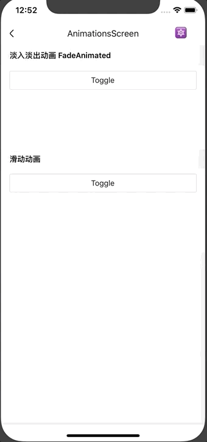

# 动画

基于 Animated 进行二次封装，支持淡入淡出（Fade）与滑动（Slide）动画。

## Usage

只支持按需引入。

```js
import { FadeAnimated, SlideAnimated } from '@roo/roo-mobile-rn/dist/common/animations'
```

## Examples



## Code
[详细 Code](https://github.com/Meituan-Dianping/beeshell/tree/master/examples/common/AnimationsScreen/index.tsx)

```js

// 初始化淡入淡出动画实例
const fade = new FadeAnimated()

// 淡入
fade.toIn().then(() => {
})

// 淡出
fade.toOut().then(() => {

})

<Animated.View
  style={[
    { width: 100, height: 100, backgroundColor: 'red' },
    {
      transform: [
        { scale: fade.getState().scale }
      ],
      opacity: fade.getState().opacity
    }
  ]}>
</Animated.View>
```

##API

### Methods

#### new FadeAnimated(params?: any)

淡入淡出动画，构造函数参数。

```js
const fade = new FadeAnimated()
```

**参数**

| Name | Type | Required | Default | Description |
| ---- | ---- | ---- | ---- | ---- |
| params | any | false | {} | 详见下面说明 |

params keys are:

- duration 动画时长，默认值为 300
- easing 动画缓动函，默认值为 Easing.elastic(0.8)
- opacityList 透明度变化数组，默认值为 [0, 1]，在动画期间，透明度从 0 到 1
- scale 大小变化数组，默认值 [0, 1]，在动画期间，大小从 0 到 1
- translateXList X 轴位移变化
- translateYList Y 轴位移变化

#### new SlideAnimated(params?: any)

滑动动画构造函数。

```js
const slide = new SlideAnimated()
```

**参数**

| Name | Type | Required | Default | Description |
| ---- | ---- | ---- | ---- | ---- |
| params | any | false | {} | 详见下面说明 |

params keys are:

- duration 动画时长，默认值为 300
- easing 动画缓动函，默认值为 Easing.elastic(0.8)
- opacityList 透明度变化数组，默认值为 [0, 1]，在动画期间，透明度从 0 到 1
- translateXList X 轴位移变化
- translateYList Y 轴位移变化

#### toIn()

动画进入。

```js
fade.toIn()
slide.toIn()
```

#### toOut()

动画离开。

```js
fade.toOut()
slide.toOut()
```
