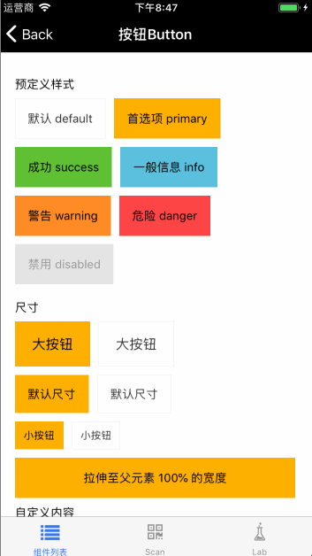
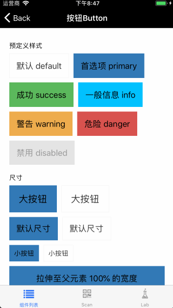

# 样式规范

## Install

```
npm install @mfe/beeshell --registry=http://r.npm.sankuai.com
```

## Usage

### 引入方式

```
import { setVaribles, colors, fontSize, padding } from '@mfe/beeshell/common/styles/varibles';
```

### Examples

#### 自定义主题

 vs


代码如下：

```
setVaribles({
    colors: {
        brandPrimary: '#337ab7',
        brandSuccess: '#5cb85c',
        brandInfo: '#01c2ff',
        brandWarning: '#f0ad4e',
        brandDanger: '#d9534f',
    },

    fontSize: {
        base: 18,
        small: 14,

        h5: 20,
    }
});

```

### Code

```jsx
import { setVaribles, colors, fontSize, padding } from '@mfe/beeshell/common/styles/varibles';

class App extends React.Component {
    render() {
        <View>
            <Text style={{
                color: colors.brandPrimary,
                paddingVertical: padding.verticalBase,
                fontSize: fontSize.h5
            }}>文本内容</Text>
        </View>
    }
}

```
