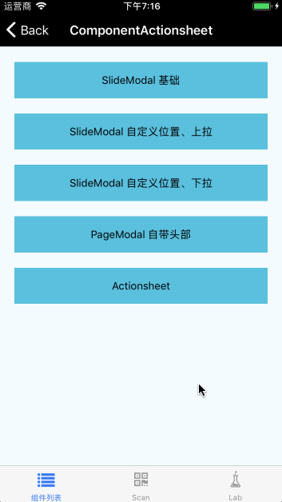

# Actionsheet

行动面板组件。

## Usage

### 全部引入

```
import { Actionsheet } from 'beeshell';
```

### 按需引入
```
import Actionsheet from 'beeshell/dist/components/Actionsheet';
```

## Examples




## Code
[详细 Code](https://github.com/Meituan-Dianping/beeshell/tree/master/examples/Actionsheet/index.tsx)

```jsx
import { Actionsheet } from 'beeshell';

<Actionsheet
  ref={(c) => { this._actionsheet = c; }}
  header='选择品类'
  data={[
    {
      label: '选项1',
      value: '1'
    },
    {
      label: '选项2',
      value: '2',
    },
    {
      label: '选项3',
      value: '3'
    },
  ]}
  cancelable={false}
  onPressConfirm={(item) => {
    console.log('confirm');
  }}
  onPressCancel={() => {
    console.log('cancel')
  }}>
</Actionsheet>

this._actionsheet.open()
this._actionsheet.close()
```

## API

继承 [SlideModal](./SlideModal.md) 组件的所有 Props、Methods。

### Props

| Name | Type | Required | Default | Description |
| ---- | ---- | ---- | ---- | ---- |
| header | string/ReactElement | false | '标题' | 头部，是字符串时代表标题文案，是 ReactElement 时代表头部渲染区域 |
| footer | string/ReactElement | false | '取消' | 底部按钮，是字符串时代表按钮文案，是 ReactE 时代表按钮渲染区域 |
| data | Array | true | [] | 数据源，数组中是对象，必须有 label 属性用于展示 |
| maxShowNum | number | false | null | 最多显示多少项，如果设置该值，超过后列表将变为可滚动 |
| cancelable | boolean | false | true | 点击蒙层是否消失 |
| useSafeAreaView | boolean | false | false | 是否开启安全区域，兼容 iPhoneX |
| renderItem | Function | false | null | 自定义渲染项。参数包括数据项，数据项索引，返回一个 ReactElement |
| onPressCancel | Function | false | null | 取消按钮点击回调 |
| onPressConfirm | Function | false | null | 点击某项回调。参数为数据项和索引 |
