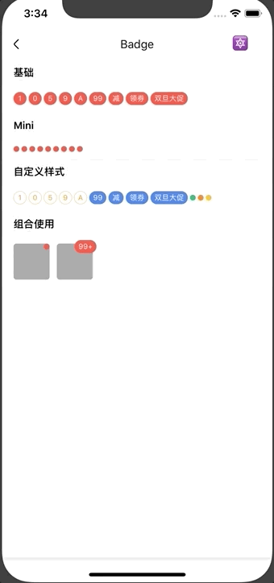

# Badge

徽章组件。

## Usage

### 全部引入
```js
import { Badge } from 'beeshell';
```

### 按需引入
```js
import { Badge } from 'beeshell/dist/components/Badge';
```

## Examples



## Code
[详细 Code](../../examples/Badge/index.tsx)

```jsx
<Badge label='99+'/>
<Badge />
```

## API

### Props
| Name | Type | Required | Default | Description |
| ---- | ---- | ---- | ---- | ---- |
| style | ViewStyle | false | {} | 样式 |
| label | string/number | false | null | 展示的文案 |
| labelStyle | TextStyle | false | {} | 文案样式 |
