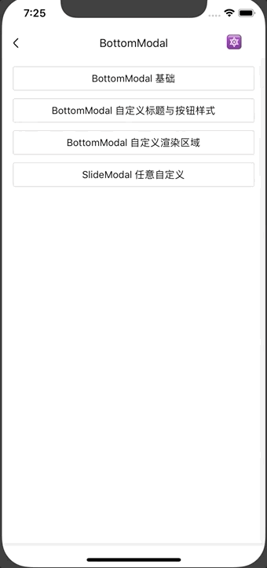

# BottomModal

半页弹窗。

## Usage

### 全部引入
```
import { BottomModal } from 'beeshell';
```

### 按需引入
```
import BottomModal from 'beeshell/dist/components/BottomModal';
```

## Examples



## Code
[详细 Code](https://github.com/Meituan-Dianping/beeshell/tree/master/examples/BottomModal/index.tsx)

```jsx
import { BottomModal } from 'beeshell';

<BottomModal
  title='选择品类'
  cancelable={true}
  leftCallback={() => {
    console.log('cancel')
  }}
  rightCallback={() => {
    console.log('confirm')
  }}>
  <View
    style={{
      backgroundColor: '#fff',
      height: 300,
      alignItems: 'center',
      justifyContent: 'center'
    }}>
    <Text>自定义内容</Text>
  </View>
</BottomModal>
```

## API

继承 [SlideModal](./SlideModal.md) 组件的所有 Props、Methods。

### Props

| Name | Type | Required | Default | Description |
| ---- | ---- | ---- | ---- | ---- |
| titleContainer | ReactElement | false | null | 自定义标题区域渲染内容 |
| title | string | false | '标题' | 标题文本 |
| titleStyle | TextStyle | false | {} | 标题文本样式 |
| leftLabel | ReactElement | false | null | 自定义左边按钮渲染区域 |
| leftLabelText | string | false | '取消' | 左边按钮文本 |
| leftLabelTextStyle | TextStyle | false | {} | 左边按钮文本样式 |
| leftCallback | Function | false | null | 左边按钮点击回调 |
| rightLabel | ReactElement | false | null | 自定义右边按钮渲染区域 |
| rightLabelText | string | false | '取消' | 右边按钮文本 |
| rightLabelTextStyle | TextStyle | false | {} | 右边按钮文本样式 |
| rightCallback | Function | false | null | 右边按钮点击回调 |