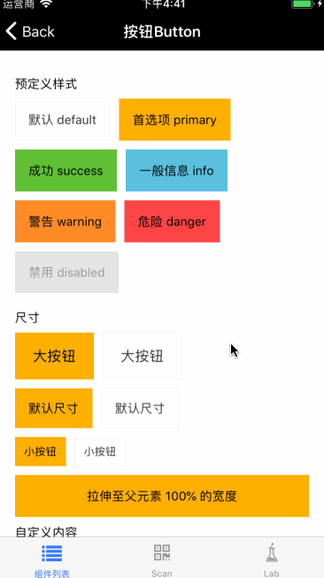

# Button

按钮组件。

## Usage
### 全部引入

```js
import { Button } from 'beeshell';
```

### 按需引入
```js
import { Button } from 'beeshell/dist/components/Button';
```

## Examples



## Code
[详细 Code](https://github.com/Meituan-Dianping/beeshell/tree/master/examples/Button/index.tsx)

```js
import { Button } from 'beeshell';

<Button type="primary" size="md" textColorInverse>首选项 primary</Button>
<Button type="primary" size="md">
  <View>
    <Text>自定义</Text>
    <Text>支持组件</Text>
  </View>
</Button>

<Button type='info' size='sm' disabled>
  信息 info
</Button>
```

## API
### Props

| Name | Type | Required | Default | Description |
| ---- | ---- | ---- | ---- | ---- |
| style | ViewStyle | false | {} | 按钮样式 |
| textStyle | TextStyle | false | {} | 按钮文本样式 |
| textColorInverse | boolean | false | false | 按钮文本是否是黑色，通过该参数，控制按钮文本颜色为黑色或者白色 |
| type | string | true | 'default' | 指明按钮的预定义样式，包括 'default' 'primary' 'success' 'info' 'warning' 'danger' 'text' |
| children | any | false | null | 子元素，可以是字符串或者 ReactElement |
| disabled | boolean | false | false | 是否可以点击 |
| size | string | false | 'md' | 尺寸，'lg' 'md' 'sm' |
| onPress | Function | false | null | 点击回调 |