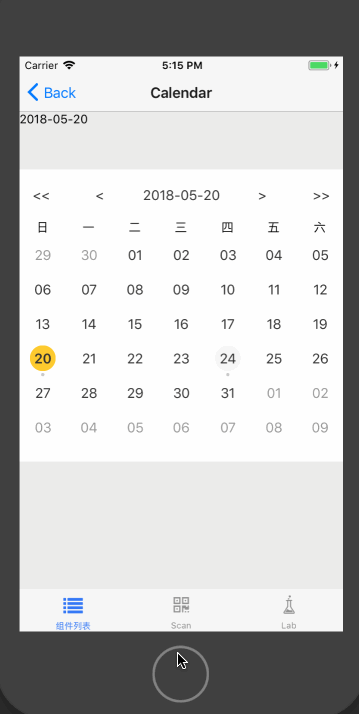

# Calendar

日历组件。

## Usage

### 全部引入
```
import { Calendar } from 'beeshell';
```
### 按需引入

```
import { Calendar } from 'beeshell/dist/components/Calendar';
```

## Examples



## Code
[详细 Code](https://github.com/Meituan-Dianping/beeshell/tree/master/examples/Calendar/index.tsx)

```jsx
import { Calendar } from 'beeshell';

<Calendar
  date={this.state.date}
  startDate={'2018-04-11'}
  endDate={'2018-06-22'}
  onChange={(date) => {
      this.setState({
          date
      });
  }}
/>
```

## API

### Props

| Name | Type | Required | Default | Description |
| ---- | ---- | ---- | ---- | ---- |
| style | ViewStyle | false | {} | 样式 |
| date | string | false | 当天 | 日期值 |
| startDate | string | false | null | 可以选择的最小日期 |
| endDate | string | false | null | 可以选择的最大日期 |
| onChange | Function | false | null | 日期修改的回调 |
| renderItem | Function | false | null | 自定义渲染项 |
