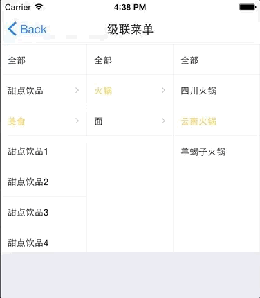

# Cascader

级联选择组件。支持嵌套（字表表示法）和扁平（父指针表示法）的树形数据结构。

## Usage

### 全部引入
```
import { Cascader } from '@roo/roo-mobile-rn';
```
### 按需引入

```
import { Cascader } from '@roo/roo-mobile-rn/dist/components/Cascader';
```

## Examples

**Cascader 与 BottomModal 组合使用**



## Code
[详细 Code](https://github.com/Meituan-Dianping/beeshell/tree/master/examples/Cascader/index.tsx)

```jsx
import { Cascader } from '@roo/roo-mobile-rn';

// 嵌套（字表表示法）表示的树形结构
const nestData = [
  {
    label: '父节点1',
    id: 1,
    children: [
		  { label: '子节点1', id: 2 },
		  { label: '子节点2', id: 3 }
    ]
  }
]

<Cascader
  data={nestData}
  dataStructureType='nested'
  value={[2]}
  onChange={(value) => {
    console.log(value)
  }}
/>

// 扁平（父指针表示法）表示的树形结构
const flattenedData = [
  { label: '父节点1', id: 1 },
  { label: '子节点1', id: 2, pId: 1 },
	{ label: '子节点2', id: 3, pId: 1 }
]

<Cascader
  data={flattenedData}
  dataStructureType='flattened'
  value={[2]}
  onChange={(value) => {
    console.log(value)
  }}
/>

```

## API

### Props

| Name | Type | Required | Default | Description |
| ---- | ---- | ---- | ---- | ---- |
| style | ViewStyle | false | {} | 样式 |
| data | any[] | true | [] | 数据源，是一个树形结构，支持子表表示法（默认通过 children 建立父子关系）和父指针表示法（默认通过 id、pId 建立关系） |
| value | any[] | false | [] | 选中的值，是一个数组（单选情况下只有一个元素，多选暂不支持），数组元素是数据源某项的唯一标志的值 |
| fieldKeys | any | false | { labelKey: 'label', idKey: 'id', pIdKey: 'pId', childrenKey: 'children', activeKey: 'active', checkedKey: 'checked', disabledKey: 'disabled'  } | 数据源的属性 key 值自定义，labelKey 用于展示，idKey 数据项的唯一标志，pIdkey 父节点唯一标志（数据源为父指针表示法时使用），childrenKey 子节点数组（数据源为子表表示法时使用），activeKey 激活状态打开其子节点，checkedKey 选中，disabledKey 禁用 |
| proportion | number[] | false | [2, 1, 1] | 数据列宽度占比，每列占比默认为 1 |
| isLeafNode | Function | false | null | 自定义叶子节点的逻辑判断 |
| onChange | Function | false | null | 选中项后的回调，参数包括 value（数组，目前只支持单选，只有一个元素）和 info（选中项以及其祖先节点） |
| renderItem | Function | false | null | 自定义渲染项，参数包括 item 和 index |

