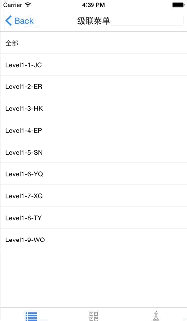
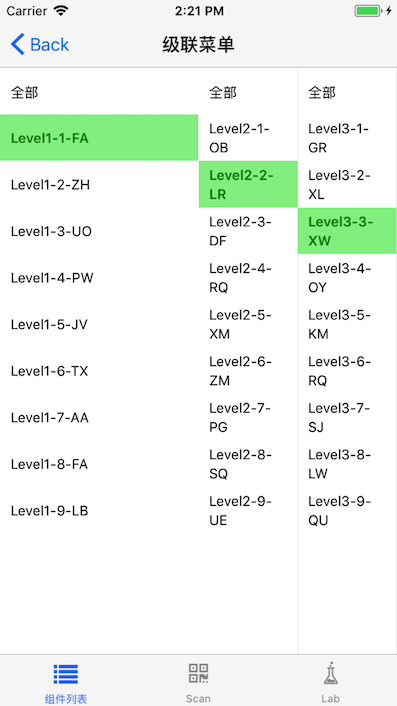

# Cascader
---

## Install

```
npm  install beeshell
```

## Usage

```
import { Cascader } from 'beeshell';
```
## 示例

### 1. 一次性输入数据, 默认选中


### 2. 异步加载数据



### 3. 异步加载数据, 并选中, 自定义样式 例子4



## CascaderItem 数据结构
```json
{
  label: '甜点饮品',
  value: 19, // 可以是 string 或者 int
  children: [
    { label: '甜品', value: 167 },
    { label: '咖啡', value: 168 }
  ],
}
```

* 可以通过  structKeys  配置键值对应. [label, value, children] 一一对应, 每一项都必填


## Usage


### 1. React.Element
Cascader 是一个 React.Element 对象, 和 [@mfe/react-native-popup](http://npm.sankuai.com/package/@mfe/react-native-popup) 一起服用效果更佳

### 2. Cascader 两种数据源

* options 一次性导入模式, 可以配合 assignedOption 一起使用
* onSyncData 异步请求模式, 也配合 assignedOption 一起使用


### 3. 一次性输入数据
```js

// constructor
this.state = {
  options:[
    {
      label: '甜点饮品',
      value: 19,
      children: [
        { label: '甜品', value: 167 },
        { label: '咖啡', value: 168 },
        { label: 'icecream', value: 169 },
      ],
    },
    {
      label: '美食',
      value: 22,
      children: [
        {
          label: '火锅',
          value: 221,
          children: [
            { label: '四川火锅', value: 500 },
            { label: '云南火锅', value: 501 },
            { label: '羊蝎子火锅', value: 502 },
          ],
        },
        {
          label: '面',
          value: 112,
          children: [
            { label: '重庆小面', value: 600 },
            { label: '山西刀削面', value: 701 },
          ],
        },
      ],
    }
  ],
  assignedOption: [22, 112, 600]; // 默认选中
}
// handle
handleConfirm(selectedChain){
  const content = selectedChain.map(item => item.label).join('/');
}
// render
<Cascader
  options={this.state.options}
  assignedOption={this.state.assignedOption}
  onConfirm={this.handleConfirm.bind(this)}
/>

```


### 4. 异步请求数据, 也支持 assignedOption
```js
// 随机两位字符
  randomStr(length) {
    let text = '';
    const possible = 'ABCDEFGHIJKLMNOPQRSTUVWXYZ';
    for (let i = 0; i < length; i++) {
      text += possible.charAt(Math.floor(Math.random() * possible.length));
    }
    return text;
  }

  /**
   * 异步请求 返回结果必须是个promise 对象
   * @param {*} option 一个选中的项目 {level}
   */
  syncLoadData(option) {
    const result = [];
    return new Promise((resolve, reject) => {
      // 这里做多返回3级菜单
      if (option.level < 3 && option.label !== '全部') {
        const nextLevel = option.level + 1;
        for (let index = 1; index < 10; index++) {
          result.push({
            name: `Level${nextLevel}-${index}-${this.randomStr(2)}`,
            value: 10 * nextLevel + index,
          });
        }
        setTimeout(() => {
          resolve(result);
        }, 200);
      } else {
        setTimeout(() => {
          reject();
        }, 200);
      }
    });
  }
// render
<Cascader
  style={{ flex: 1 }}
  onConfirm={this.handleConfirm.bind(this)}
  onChange={this.handleChange.bind(this)}
  itemSelectedStyle={{ color: 'green', backgroundColor: 'lightgreen' }}
  flexCols={[2, 1, 1]}
  structKeys={['name', 'value', 'child']}
  onSyncData={this.syncLoadData.bind(this)}
  assignedOption={[11,22,33]}
/>
```

### 5. 样式自定义
```js
// constructor
this.state = {
  options:[
    {
      name: '甜点饮品',
      val: 19,
      child: [
        { name: '甜品', val: 167 },
        { name: '咖啡', val: 168 },
        { name: 'icecream', val: 169 },
      ],
    },
    {
      name: '美食',
      val: 22,
      child: [
        {
          name: '火锅',
          val: 221,
          child: [
            { name: '四川火锅', val: 500 },
            { name: '云南火锅', val: 501 },
            { name: '羊蝎子火锅', val: 502 },
          ],
        },
        {
          name: '面',
          val: 112,
          child: [
            { name: '重庆小面', val: 600 },
            { name: '山西刀削面', val: 701 },
          ],
        },
      ],
    },
  ],
  assignedOption: [22, 112, 701]; // 默认选中
}

// handle
handleConfirm(selectedChain){
  const content = selectedChain.map(item => item.label).join('/');
}

// render
// structKeys  键值对应 按照, label, value, children 一一对照
<Cascader
  style={{ height: 300 }}
  options={this.state.options}
  assignedOption={this.state.assignedOption}
  onConfirm={this.handleConfirm.bind(this)}
  onChange={this.handleChange.bind(this)}
  itemSelectedStyle={{ color: 'blue', backgroundColor: 'lightyellow' }}
  flexCols={[2, 2, 1]}
  structKeys={['name', 'val', 'child']} 
/>

```


## Cascader 级联菜单 Attributes

| 参数       | 说明                                        | 类型      | 默认值  | 可选值 |
|------------|--------------------------------------------|-----------|---------------|---------|
|  options    |  树形结构, 数据结构见上面  | array | [CascaderItem] |  可选 |
|  assignedOption | 默认选中的数组值  | array[value] |  undefined | 可选  |
|  onSyncData |  异步请求的函数, 返回值必须是一个Promise,入参是一个选择项 {label,value,level} 对象  | Promise   |  --  | -- | 
|  flexCols |  各列的相对宽度, 长度要和最大列数一致, 支持默认选中, 异步请求时支持     | array[int]   |  --  | 可选 | 
|  structKeys |  CascaderItem key值对应, 适配不同的结构体, 异步请求时也支持   | ['label','value','children']    |  true  | 可选 | 
|  itemStyle |   选择项的样式   | ReactNative.style   | --  | 可选 | 
|  itemSelectedStyle |  选择项选中后的样式    | ReactNative.style   |  --  | 可选 | 

### 注意

* onSyncData 和 options 异步数据和一次性数据不同时使用
* assignedOption 同时支持 options,和 onSyncData 两种方式
* assignedOption 最后一列可以是 -1, 这样只打开而不会选中
* structKeys  键值对应 按照, [label, value, children] 一一对应, 每一项都必填
* flexCols 如果不设置,就会按照当前列数自动均分. onSyncData 和 options 两种模式可以使用


## Cascader 级联菜单 Events

| 事件名称       | 说明                                        | 回调参数    |
|------------|--------------------------------------------|-----------|
|  onConfirm   | 最终选中的值, 没有children的时候触发 | array[CascaderItem] |
|  onChange    | 每次点击时触发, 有children的时候触发  | array[CascaderItem] |

### 注意

* onConfirm 和 onChange 的触发条件互斥


## feature
- [ ] 列相对布局, 如果设置那么按照设置的来, 默认按列数动态调整
- [ ] 默认插入全部选项 方便全选

flexCols

options, assignedOption 一起使用
onSyncData 异步请求,支持异步请求并且默认选中


structKeys值[label, value, children]

## TODO

- [x] 多列
- [x] 默认选择, 自动打开
- [x] 多列默认选择, 参考casader
- [x] 是否联动, 以及对应的数据格式
- [x] 不同列单独的数据请求, promise 等, 然后请求下一页面
- [x] 异步数据接口,暂时不做默认选中?
- [x] itemStyle itemSelectStyle
- [x] 列相对布局, 设置过才起作用
- [x] 数据格式key值转换
- [x] onChange
- [ ] 减少 render 次数
- [x] Android 兼容性
- [ ] typescript 兼容