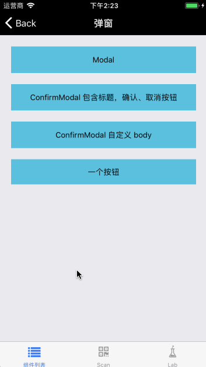
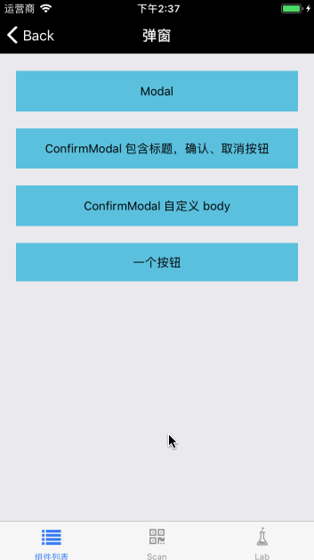
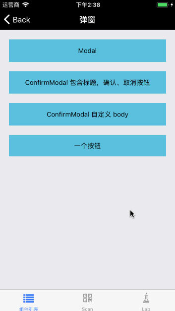

# ConfirmModal

继承自 [Modal](./Modal.md) 组件，属于 Modal 系列，包含标题，确认、取消按钮，body 部分支持简单字符串与 React 组件。


## Install

```
npm  install beeshell
```

## Usage

### 引入方式
#### 全部引入
```
import { ConfirmModal } from 'beeshell';
```

#### 单独引入
```
import ConfirmModal from 'beeshell/components/Modal/extensions/ConfirmModal';
```


### Examples

#### 简单文案
如果 body 部分只是想展示简单的文案，可以设置 body="只提供简单文案"，设置了 body 属性非空后，子组件的内容不再展示。



代码如下：

```
<ConfirmModal
    ref={(c) => { this._confirmModal = c; }}
    title="是否退出编辑？"
    body="只提供简单文案"
    cancelable={false}
    cancelCallback={() => {
        console.log('cancel');
    }}
    confirmCallback={() => {
        console.log('confirm');
    }}>
</ConfirmModal>
```


#### 自定义子组件
body 部分为自定义组件，注意设置属性 body="" 才会展示子组件。



代码如下：

```
<ConfirmModal
    ref={(c) => { this._confirmModal = c; }}
    title="是否退出编辑？"
    body=""
    cancelable={false}
    cancelCallback={() => {
        console.log('cancel');
    }}
    confirmCallback={() => {
        console.log('confirm');
    }}>

    <View style={{flex: 1}}>
        <Image
            style={{ height: 150 }}
            source={{ uri: 'https://b-ssl.duitang.com/uploads/item/201503/15/20150315221839_MhjcK.thumb.700_0.jpeg' }}
        />
    </View>
</ConfirmModal>
```

#### 一个按钮
只提供一个回调函数就会实现只有一个按钮的效果。




### Code

```jsx
import { ConfirmModal } from 'beeshell';

class App extends React.Component {
    render() {
        <View>
            <TouchableOpacity
                onPress={() => {
                    this._confirmModal.open();
                }}>
                <Text>包含标题，确认、取消按钮</Text>
            </TouchableOpacity>

            <ConfirmModal
                ref={(c) => { this._confirmModal = c; }}
                title="是否退出编辑？"
                body="只提供简单文案"
                cancelable={false}
                cancelCallback={() => {
                    console.log('cancel');
                }}
                confirmCallback={() => {
                    console.log('confirm');
                }}>
            </ConfirmModal>
        </View>
    }
}


```

### Props

| Name | Type | Required | Default | Description |
| ---- | ---- | ---- | ---- | ---- |
| cancelable | Boolean | false | true | 点击蒙层是否消失 |
| title | String | false | '标题' | 弹窗标题 |
| body | String | false | 'hello world' | 弹窗 body 部分简单文案，若 `body=""` 且组件有子组件，则可以展示子组件 |
| autoCloseOnPress | Boolean | false | true | 点击按钮是否自动关闭弹窗 |
| cancelCallback | Function | false | null | 取消按钮点击回调 |
| cancelTitle | String | false | '取消' | 取消按钮文案 |
| confirmCallback | Function | false | null | 确认按钮点击回调 |
| confirmTitle | String | false | '确认' | 确认按钮文案 |

### Methods
#### .open()

打开弹窗。

```
    this._confirmModal.open();
```

#### .close()

关闭弹窗。

```
    this._confirmModal.close();
```

### 其他

继承 [Modal](./Modal.md) 组件的所有 Props、Methods。
