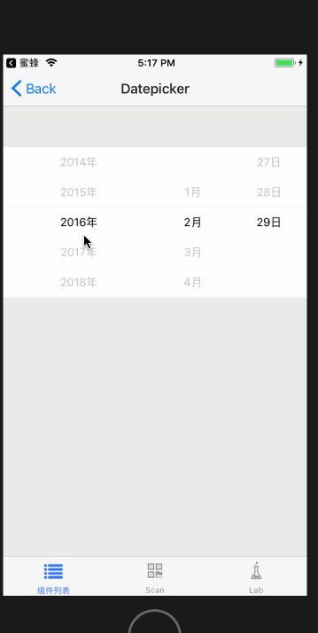

# Datepicker

日期选择组件。滚动选择交互，基于 Scrollpicker 实现。

## Usage

### 全部引入
```js
import { Datepicker } from '@roo/roo-mobile-rn';
```
### 按需引入

```js
import Datepicker from '@roo/roo-mobile-rn/dist/components/Datepicker';
```

## Examples
**Datepicker 与 BottomModal 组合应用**



## Code
[详细 Code](https://github.com/Meituan-Dianping/beeshell/tree/master/examples/Datepicker/index.tsx)

```jsx
import { Datepicker } from '@roo/roo-mobile-rn';

<Datepicker
  proportion={[2, 1, 1]}
  startYear={2010}
  numberOfYears={10}
  date='2016-03-30'
  onChange={(date) => {
    console.log(date)
  }}
/>
```

## API

### Props

| Name | Type | Required | Default | Description |
| ---- | ---- | ---- | ---- | ---- |
| startYear | number | true | null | 开始年份 |
| proportion | number[] | false | [2, 1, 1] | 数据列 UI 样式占比 |
| numberOfYears | number | true | null | 向后显示几年 |
| date | string | false | null | 选定的日期字符串，'YYYY-MM-DD' 格式 |
| onChange | Function | false | null | 数据变化回调|

组合使用 [Scrollpicker](./Scrollpicker.md) 组件，透传 Scrollpicker 所有 Props
