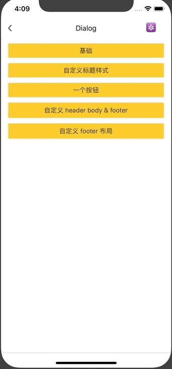

# Dialog
对话框组件。

## Usage

### 全部引入
```js
import { Dialog } from 'beeshell';
```

### 单独引入
```js
import Dialog from 'beeshell/dist/components/Dialog';
```

## Examples



## Code
[详细 Code](https://github.com/Meituan-Dianping/beeshell/tree/master/examples/Dialog/index.tsx)

```jsx
import { Dialog } from 'beeshell';

<Dialog
  ref={(c) => {
    this._dialog = c
  }}
  cancelable={true}
  title='系统提示'
  bodyText='确认删除该信息？'
  cancelCallback={() => {
    console.log('cancel')
  }}
  confirmCallback={() => {
    console.log('confirm')
  }}
/>

this._dialog.open()
this._dialog.close()
```

## API

继承 [Modal](./Modal.md) 组件的所有 Props、Methods。

### Props

| Name | Type | Required | Default | Description |
| ---- | ---- | ---- | ---- | ---- |
| title | string | false | '标题' | 标题 |
| titleStyle | TextStyle | false | {} | 标题样式 |
| header | ReactElement | false | null | 自定义头部渲染区域 |
| bodyText | string | false | '内容' | 内容文本 |
| bodyTextStyle | TextStyle | false | {} | 内容文本样式 |
| body | ReactElement | false | null | 自定义内容渲染区域 |
| cancelLabel | ReactElement | false | null | 自定义取消按钮渲染区域 |
| cancelLabelText | string | false | '取消' | 取消按钮文本 |
| cancelLabelTextStyle | TextStyle | false | {} | 取消按钮文本样式 |
| cancelCallback | Function | false | null | 取消按钮点击回调 |
| confirmLabel | ReactElement | false | null | 自定义确认按钮渲染区域 |
| confirmLabelText | string | false | '取消' | 确认按钮文本 |
| confirmLabelTextStyle | TextStyle | false | {} | 确认按钮文本样式 |
| confirmCallback | Function | false | null | 确认按钮点击回调 |
| operationsLayout | string | false | 'row' | 操作按钮布局，支持 'row' 'column' |
| operations | Array | false | null | 自定义操作按钮组，该属性会覆盖前面的 cancel、confirm 按钮相关属性。数组元素为对象 { label: ReactElement, labelText: string, labelTextStyle: TextStyle, type: string, onPress: Function } |
