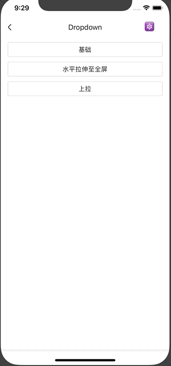

# Dropdown

下拉选择。

## Usage

### 全部引入
```
import { Dropdown } from '@roo/roo-mobile-rn';
```

### 按需引入
```
import { Dropdown } from '@roo/roo-mobile-rn/dist/modules/Dropdown';
```

## Examples



## Code
[详细 Code](https://github.com/Meituan-Dianping/beeshell/tree/master/examples/Dropdown/index.tsx)

```jsx
import { Dropdown } from '@roo/roo-mobile-rn';

<Dropdown
  ref={(c) => {
    this.dropdown = c
  }}
  offsetX={this.state.offsetX}
  offsetY={this.state.offsetY}
  cancelable={true}
  value={1}
  data={[
    {
      label: '我关注的',
      value: 1
    },
    {
      label: '离我最近',
      value: 2
    },
    {
      label: '综合评分最高的的的',
      value: 3
    }
  ]}
  onChange={(value) => {
    console.log(value)
  }}
/>

```

## API

继承 [SlideModal](./SlideModal.md) 组件的所有 Props、Methods。组合 [Radio](./Radio.md) 组件，透传 Radio 部分 Props

### Props

| Name | Type | Required | Default | Description |
| ---- | ---- | ---- | ---- | ---- |
| style | ViewStyle | false | {} | 样式 |
| direction | string | false | 'down' | 方向，只支持 'up' 'down' |
| checkedIcon | ReactElement | false | 同 Radio | 选中图标 |
| uncheckedIcon | ReactElement | false | 同 Radio | 未选中图标 |
| data | Array | true | [] | 数据源，数组中元素是一个对象，必须包含 label 属性用于展示 |
| value | any | false | null | 选中项的值 |
| onChange | Function | false | null | 选中项变化的回调 |

### Methods

#### .open()

打开。

```
this._dropdown.open();
```

#### .close()

关闭。

```
this._dropdown.close();
```
