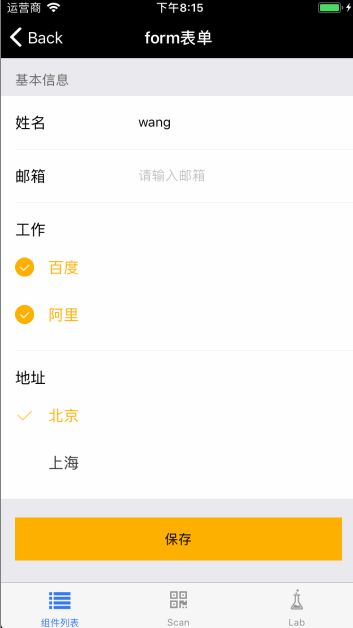
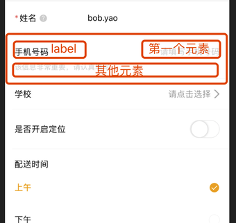

# Form

表单组件。

## Usage

### 全部引入
```
import { Form } from '@roo/roo-mobile-rn';
```

### 按需引入
```
import { Form } from '@roo/roo-mobile-rn/dist/components/Form';
```

## Examples

**Standard**



**布局设计**

一个 Form.Item 内部分成三个区域，label 放在左边，Form.Item 的 children 的第一个元素放在右边，其他 children 放在下面。如图所示：



## Code
[详细 Code](https://github.com/Meituan-Dianping/beeshell/tree/master/examples/Form/index.tsx)

```jsx
import { Form, Input } from '@roo/roo-mobile-rn';

<Form>
  <Form.Item label="姓名" hasLine>
    <Input value="" onChange={() => {}} />
    <Text>描述信息<Text>
  </Form.Item>
  <Form.Item label="邮箱" labelWidth={100} hasLine>
    <Input value="" onChange={() => {})} />
  </Form.Item>
</Form>
```

## API

### Form Props

| Name | Type | Required | Default | Description |
| ---- | ---- | ---- | ---- | ---- |
| style | ViewStyle | false | {} | 表单样式 |

### Form.Item Props

| Name | Type | Required | Default | Description |
| ---- | ---- | ---- | ---- | ---- |
| style | ViewStyle | false | {} | 表单项样式 |
| label | string/ReactElement | false | '标题' | 表单项标签，可以是字符串或者 ReactElement |
| labelWidth | number | false | 90 | 表单项标签宽度 |
| hasLine | boolean | false | false | 在表单项下是否有横线 |
| children | ReactChild[]|ReactChild | false | null | 表单项子元素 |