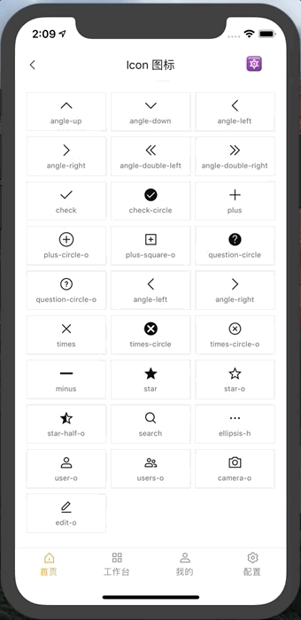

# Icon

图标组件。 

使用 Image 元素实现，并且在本组件库的其他组中使用。因为 Android 平台不支持 tintColor 属性，所以使用场景很有限，请根据自己的实际情况使用。推荐在自己的项目中集成字体文件功能。

## Usage

### 全部引入
```
import { Icon } from 'beeshell';
```

### 按需引入
```
import { Icon } from 'beeshell/dist/components/Icon';
```

## Examples



## Code
[详细 Code](../../examples/Icon/index.tsx)

```jsx
import { Icon } from 'beeshell'

<Icon type='caret-down' size={14} tintColor='#FECB2E' />
<Icon type='times-circle-o' size={20} tintColor='red' />
```

## API

### Props
| Name | Type | Required | Default | Description |
| ---- | ---- | ---- | ---- | ---- |
| style | ImageStyle | false | {} | 样式 |
| type | string | true | 'caret-down' | 图标类型 |
| size | number | false | 20 | 图标大小 |
| tintColor | string | false | brandPrimaryDark 的色值 | 图标颜色，注意只支持 iOS 平台 |
| source | ImageSourcePropType | false | null | 自定义图片 |
