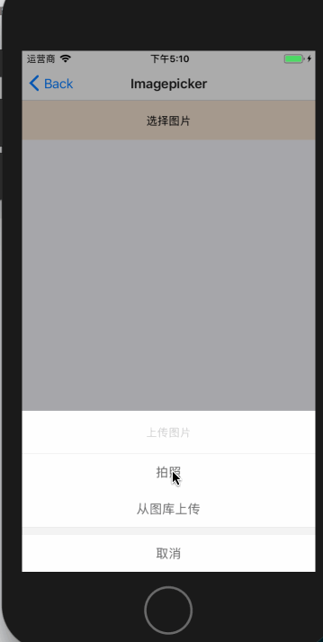
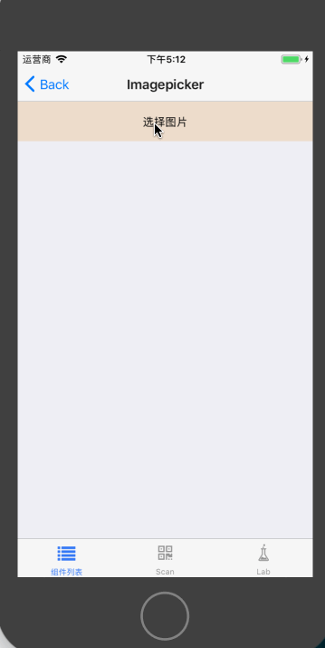
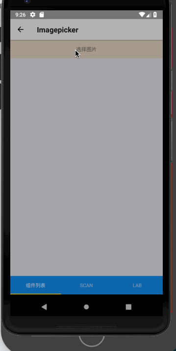

# Imagepicker

图片选择组件，属于复合组件，包含 Native 部分代码。


## Install

```
npm install @mfe/beeshell --registry=http://r.npm.sankuai.com
```

## Usage

### 引入方式
#### 全部引入
```
import { Imagepicker } from '@mfe/beeshell';
```
#### 单独引入

```
import Imagepicker from '@mfe/beeshell/modules/Imagepicker';
```

### Examples

#### iOS 基本用法


#### iOS 自定义按钮


#### Android 自定义按钮


### Code

```jsx
import { Imagepicker } from '@mfe/beeshell';

class App extends React.Component {
    render() {
        const configs = {
            title: '上传图片',
            cancelButtonTitle: '取消',
            takePhotoButtonTitle: '拍照',
            chooseFromLibraryButtonTitle: '从图库上传',
            maxWidth: 1600,
            maxHeight: 1200,
            isAllowCrop: true,
            isAllowRotate: true,
            aspectX: 4,
            aspectY: 3,
            quality: 1,

            customButtons: {
                delImage: {
                    title: '删除',
                    position: 'top',
                    brandColor: 'brandWarning',
                },

            },

            responseFileType: 'base64',

            callback(res) {
                console.log(res);
            },

            onCustomButtonPress(btn) {
                console.log(btn);
            }
        }
        return(
            <View>
                <TouchableOpacity
                    onPress={() => {
                        this._imagepicker.open();
                    }}>
                    <Text>基础用法</Text>
                </TouchableOpacity>

                <Imagepicker
                        ref={(c) => {
                            this._imagepicker = c;
                        }}
                        {...configs}>
                    </Imagepicker>
            </View>
        );
    }
}


```

### Props

| Name | Type | Required | Default | Description |
| ---- | ---- | ---- | ---- | ---- |
| title | String | false | '标题' | 标题文案 |
| cancelButtonTitle | String | false | '取消' | 取消按钮文案 |
| takePhotoButtonTitle | String | false | '拍照' | 拍照按钮文案 |
| chooseFromLibraryButtonTitle | String | false | '从图库上传' | 图库选择文案 |
| maxWidth | Number | false | 1600 | 最大宽度 |
| maxHeight | Number | false | 1200 | 最大高度 |
| isAllowCrop | Boolean | false | false | 是否可以裁剪 |
| isAllowRotate | Boolean | false | false | 是否可以旋转 |
| aspectX | Number | false | 4 | 裁剪宽 |
| aspectY | Number | false | 3 | 裁剪高 |
| quality | Number | false | 1 | 图片质量，值为小数 |
| customButtons | Object | false | null | 自定义按钮 `{ title: '按钮文案', position: 'top/bottom', brandColor: 'brandWarning/brandSuccess/brandDanger/brandInfo/brandPrimary' }` |
| onCustomButtonPress | Function | false | null | 自定义按钮点击回调 |
| callback | Function | false | null | 选择图片成功后的回调 |
| responseFileType | String | false | null | 选择图片成功后返回的文件的类型，如 'base64' |

### Methods

#### .open()

打开选择面板。

```
    this._imagepicker.open();
```

#### .close()

关闭面板。

```
    this._imagepicker.close();
```
