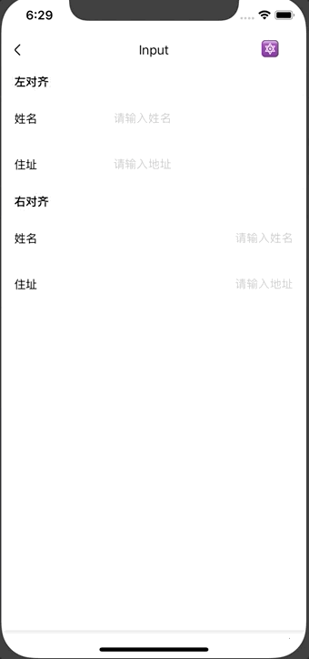

# Input

输入框组件。

## Usage

### 全部引入
```js
import { Input } from 'beeshell';
```

### 按需引入
```js
import { Input } from 'beeshell/dist/components/Input';
```

## Examples

**iOS 平台**



**Android 平台支持清空功能**


## Code

[详细 Code](https://github.com/Meituan-Dianping/beeshell/tree/master/examples/Input/index.tsx)

```jsx
import { Input } from 'beeshell';

<Input
  textAlign='right'
  value={''}
  placeholder='请输入地址'
  onChange={(value) => {
    console.log(value)
  }}
/>

```

## API

### Props

组合使用 RN TextInput 组件，透传 TextInput 所有属性。

| Name | Type | Required | Default | Description |
| ---- | ---- | ---- | ---- | ---- |
| style | ViewStyle | false | {} | 样式 |
| inputStyle | TextStyle | false | {} | 输入框的样式，与 RN TextInput style 属性一致 |
| value | string | false | '' | 值 |
| onChange | Function | false | null | 值变化的回调，参数为输入的文本字符串 |
