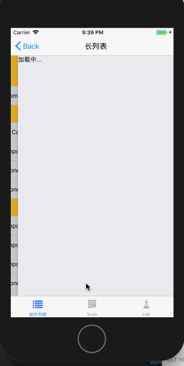

# Longlist

长列表组件，基于 FlatList 实现，支持下拉刷新，上拉加载更多。

## Usage

### 全部引入
```js
import { Longlist } from 'beeshell';
```

### 按需引入
```js
import Longlist from 'beeshell/dist/components/Longlist';
```

## Examples


## Code
[详细 Code](https://github.com/Meituan-Dianping/beeshell/tree/master/examples/Longlist/index.tsx)

```js
import { Longlist } from 'beeshell';

<Longlist
  ref={(c) => {
    this._longlist = c
  }}
  total={total}
  data={list}
  renderItem={({ item, index }) => {
    return (
      <View
        style={{
          marginBottom: 12,
          paddingVertical: 30,
          paddingHorizontal: variables.mtdHSpacingXL,
          backgroundColor: '#fff'
        }}>
        <Text style={{ color: variables.mtdGrayBase }}>{item.label}</Text>
      </View>
    )
  }}
  onEndReached={() => {}}
  onRefresh={() => {}}
/>

```

## API

基于 FlatList 实现，支持 FlatList 的所有属性和方法，如有需要请参考官方文档。

### Props

| Name               | Type         | Required | Default | Description |
| ---- | ---- | ---- | ---- | ---- |
| data               | Array        | true     | []      | 数据源                       |
| total              | number       | false    | 0       | 总长度                       |
| renderItem         | Function     | true     | null    | 渲染每一项                   |
| onEndReached       | Function     | true     | null    | 当列表被滚动到距离内容最底部不足 onEndReachedThreshold 的距离时调用。无参数，需要返回一个 Promise 对象 |
| onRefresh          | Function     | false    | null    | 下拉刷新回调。无参数，需要返回一个 Promise 对象 |
| renderFooter       | Function     | false    | null    | 自定义页脚部分渲染内容。参数为 loading 加载状态，data 数据源，total 数据总长度，需要返回一个 ReactElement |

### Methods

通过 ref 获取 Longlist 实例 _longlist，然后 _longlist.flatList 为 FlatList 实例，可以调用所有方法。下面以 scrollToIndex 方法举例说明。

#### scrollToIndex

滚动到指定位置。

```
this._longlist.flatList.scrollToIndex({
  index: 9
})
```
**参数**

| Name               | Type         | Required | Default | Description |
| ---- | ---- | ---- | ---- | ---- |
| params             | object       | true     | undefined | 看下面说明 |

params keys are:

- 'animated' (boolean) - Whether the list should do an animation while scrolling. Defaults to true.
- 'index' (number) - The index to scroll to. Required.
- 'viewOffset' (number) - A fixed number of pixels to offset the final target position. Required.
- 'viewPosition' (number) - A value of 0 places the item specified by index at the top, 1 at the bottom, and 0.5 centered in the middle.
