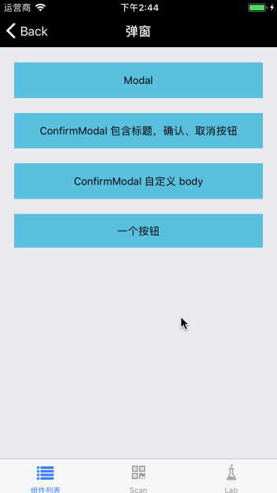

# Modal

beeshell 组件库把所有基础组件分成一个个系列，如：Modal 系列、Form 系列、日历系列，每个系列内部使用继承的方式（ES6 Class）复用代码。

Modal 是 Modal 系列所有组件的父类，例如 SlideModal 就继承自 Modal 并做了相应的扩展，这些继承关系用户不需要关心，但知道了继承关系可以加深对组件的理解。


## Install

```
npm install beeshell 
```

## Usage

### 引入方式
#### 全部引入
```
import { Modal } from 'beeshell';
```

#### 单独引入
```
import Modal from 'beeshell/components/Modal';
```


### Examples



可以看到弹出内容比较简陋，弹出内容完全由用户自定义，定制化程度高，如果没有这么高的定制化需求，我们也提供了在 Modal 基础上的规范化封装组件（继承自 Modal），例如：[ConfirmModal](./ConfirmModal)。

这里体现了我们组件库的设计思路，兼顾通用性与定制化，如果组件能满足用户的需求就直接使用，如果不能满足，用户可以继承组件作为父类自己做二次扩展。

### Code

```jsx
import { Modal } from 'beeshell';

class App extends React.Component {
    render() {
        <View>
            <TouchableOpacity
                onPress={() => {
                    this._modal.open();
                }}>
                <Text>基础用法</Text>
            </TouchableOpacity>

            <Modal
               ref={(c) => { this._modal = c; }}
               cancelable={true}>

               <View>
                   <Text>ref 获取组件实例</Text>
                   <Text>
                       cancelable={'{'}true{'}'}
                       点击蒙层消失
                   </Text>
               </View>
            </Modal>
        </View>
    }
}


```

### Props

| Name | Type | Required | Default | Description |
| ---- | ---- | ---- | ---- | ---- |
| cancelable | Boolean | false | true | 点击蒙层是否消失 |
| alignItems | String | false | 'center' | 不常用，弹出内容纵向位置 |
| opacity | Number | false | 0.3 | 不常用，遮罩透明度 |
| flex | Number | false | null | 不常用，值为 null 或者 1，弹出内容水平方向拉伸至全屏 |
| marginHorizontal | Number | false | 0 | 不常用，弹出内容水平 margin |
| marginTop | Number | false | 90 | 不常用，对应 alignItems: 'flex-start' |
| marginBottom | Number | false | 90 | 不常用，对应 alignItems: 'flex-end' |
| onOpen | Function | false | null | 打开弹窗回调 |
| onOpened | Function | false | null | 打开弹窗后回调 |
| onClose | Function | false | null | 关闭弹窗回调 |
| onClosed | Function | false | null | 关闭弹窗后回调 |

### Methods

#### .open()

打开弹窗。

```
    this._modal.open();
```

#### .close()

关闭弹窗。

```
    this._modal.close();
```
