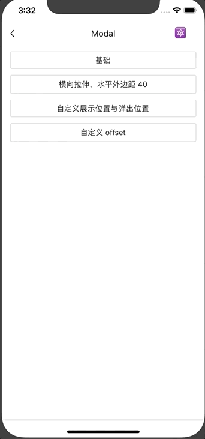

# Modal
模态窗组件。Modal 是一个基础弹窗，内容完全由用户自定义，定制化程度极高。如果没有这么高的定制化需求，我们也提供了在 Modal 基础上的封装组件（继承自 Modal），例如：[Dialog](./Dialog)。

## Usage

### 全部引入
```js
import { Modal } from '@roo/roo-mobile-rn';
```

### 按需引入
```js
import { Modal } from '@roo/roo-mobile-rn/dist/components/Modal';
```

## Examples



## Code
[详细 Code](https://github.com/Meituan-Dianping/beeshell/tree/master/examples/Modal/index.tsx)

```jsx
import { Modal } from '@roo/roo-mobile-rn';

<Modal
  ref={(c) => { this._modal = c; }}
  cancelable={true}>

  <View>
      <Text>ref 获取组件实例</Text>
      <Text>
          cancelable={'{'}true{'}'}
          点击蒙层消失
      </Text>
  </View>
</Modal>

this._modal.open()
this._modal.close()
```

### Props

| Name | Type | Required | Default | Description |
| ---- | ---- | ---- | ---- | ---- |
| containerStyle | ViewStyle | false | {} | 弹框容器样式 |
| style | ViewStyle | false | {} | 弹框样式 |
| cancelable | boolean | false | true | 点击蒙层是否消失 |
| scrollable | boolean | false | false | 内容超出屏幕是否可以滚动 |
| backdropColor | string | false | 'rgba(0, 0, 0, 0.3)' | 蒙层颜色 |
| screenWidth | number | false | screen.width | 屏幕宽度 |
| screenHeight | number | false | screen.height | 屏幕高度 |
| offsetX | number | false | 0 | X 轴偏移 |
| offsetY | number | false | 0 | Y 轴偏移 |
| animatedTranslateX | number | false | null | 弹出位置的 X 轴坐标，默认从屏幕中间弹出 |
| animatedTranslateY | number | false | null | 弹出位置的 Y 轴坐标，默认从屏幕中间弹出 |
| onOpen | Function | false | null | 打开弹窗回调 |
| onOpened | Function | false | null | 打开弹窗后回调 |
| onClose | Function | false | null | 关闭弹窗回调 |
| onClosed | Function | false | null | 关闭弹窗后回调 |


### Methods

#### .open()

打开弹窗。返回值是一个 Promise 对象。

```js
  this._modal.open();
```

#### .close()

关闭弹窗。返回值是一个 Promsie 对象。

```js
  this._modal.close();
```
