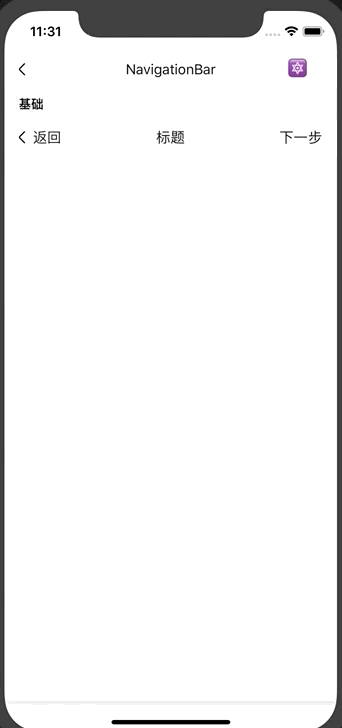

# NavigationBar
导航条组件。

## Usage

### 全部引入
```
import { NavigationBar } from '@roo/roo-mobile-rn';
```

### 按需引入
```
import { NavigationBar } from '@roo/roo-mobile-rn/dist/components/NavigationBar';
```

## Examples


## Code
[详细 Code](https://github.com/Meituan-Dianping/beeshell/tree/master/examples/NavigationBar/index.tsx)

```jsx
import { NavigationBar } from '@roo/roo-mobile-rn';

<NavigationBar
  title='标题'
  backLabel='返回'
  forwardLabel='下一步'
  onPressBack={() => {
  }}
  onPressForward={() => {
  }}
/>
```

## API

### Props
| Name | Type | Required | Default | Description |
| ---- | ---- | ---- | ---- | ---- |
| style | ViewStyle | false | {} | 自定义样式 |
| title | any | false | '标题' | 中间区域展示内容，可以是字符串或者 ReactElement |
| backLabel | any | false | '返回' | 左边区域展示内容，可以是字符串或者 ReactElement |
| forwardLabel | any | false | '下一步' | 右边区域展示内容，可以是字符串或者 ReactElement |
| onPressBack | Function | false | null | 左边区域点击回调 |
| onPressForward | Function | false | null | 右边区域点击回调 |
| proportion | number[] | false | [1, 2, 1] | 渲染区域布局占比 |
| renderItem | Function | false | null | 自定义每个渲染区域 |