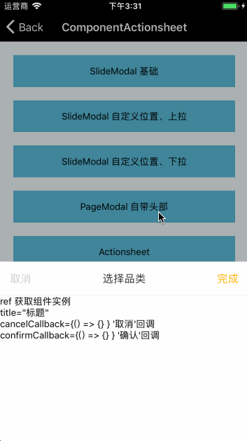

# PageModal

继承自 [SlideModal](./SlideModal.md) 组件，属于 Modal 系列。

## Install

```
npm install @mfe/beeshell --registry=http://r.npm.sankuai.com
```

## Usage
### 引入方式
#### 全部引入
```
import { PageModal } from '@mfe/beeshell';
```

#### 单独引入
```
import PageModal from '@mfe/beeshell/modules/PageModal';
```


### Examples



在 SlideModal 基础上做的扩展，提供了规范化的头部，包含标题，确定、取消按钮，body 部分自定义。


### Code

```jsx
import { PageModal } from '@mfe/beeshell';

class App extends React.Component {
    render() {
        <View>
            <TouchableOpacity
                onPress={() => {
                    this._pageModal.open();
                }}>
                <Text>带头部的底部上拉</Text>
            </TouchableOpacity>

            <PageModal
                ref={(c) => { this._pageModal = c; }}
                title="选择品类"
                cancelable={true}
                cancelCallback={() => {
                }}
                confirmCallback={() => {
                }}>

                <Text>ref 获取组件实例</Text>
                <Text>title="标题"</Text>
                <Text>
                cancelCallback={'{'}() => {'{'}{'}'} {'}'}
                '取消'回调
                </Text>
                <Text>
                confirmCallback={'{'}() => {'{'}{'}'} {'}'}
                '确认'回调
                </Text>
            </PageModal>
        </View>
    }
}


```

### Props

| Name | Type | Required | Default | Description |
| ---- | ---- | ---- | ---- | ---- |
| cancelable | Boolean | false | true | 点击蒙层是否消失 |
| title | String | false | '标题' | 标题 |
| cancelCallback | Function | false | null | 取消按钮点击回调 |
| confirmCallback | Function | false | null | 确认按钮点击回调 |
| confirmText | String | false | ' 完成' | 完成按钮文字 |

### Methods
#### .open()

打开弹窗。

```
    this._pageModal.open();
```

#### .close()

关闭弹窗。

```
    this._pageModal.close();
```

### 其他

继承 [SlideModal](./SlideModal.md) 组件的所有 Props、Methods。
