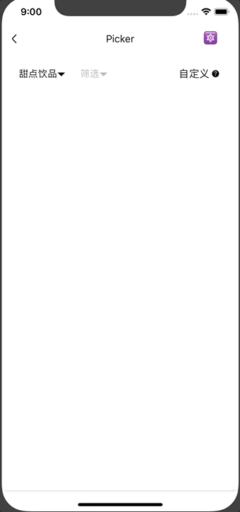

# Picker

筛选器。

## Usage

### 全部引入
```
import { Picker } from '@roo/roo-mobile-rn';
```

### 按需引入
```
import Picker from '@roo/roo-mobile-rn/dist/components/Picker';
```

## Examples




## Code

```jsx
import { Picker } from '@roo/roo-mobile-rn';

<Picker
  ref={(c) => {
    this._picker_ = c
  }}
  label='甜点饮品'
  disabled={false}
  cancelable={true}
  onToggle={(active) => {
    console.log(active)
  }}>

  <View
    style={{
      backgroundColor: '#fff',
      alignItems: 'center',
      justifyContent: 'center',
      height: 100,
      borderTopColor: '#ddd',
      borderTopWidth: StyleSheet.hairlineWidth
    }}>
    <Text>内容区</Text>
  </View>
</Picker>

```

## API

组合使用 [SlideModal](./SlideModal.md) 组件，可透传 SlideModal 部分 Props

### Props

| Name | Type | Required | Default | Description |
| ---- | ---- | ---- | ---- | ---- |
| style | ViewStyle | false | {} | 样式 |
| label | string/Function | false | '请选择' | 按钮展示内容，是字符串时代表按钮文案，是函数时需要返回一个 ReactElement，代表渲染区域，函数参数为 active，表示打开、关闭状态  |
| disabled | boolean | false | false | 是否可以打开或者关闭 |
| cancelable | boolean | false | true | 点击蒙层是否关闭 |
| onToggle | Function | false | null | 激活状态切换回调，参数为 active 表示激活状态 |

### Methods

#### .open()

打开。返回值是一个 Promsie 对象。

```
this._picker_.open();
```

#### .close()

关闭。返回值是一个 Promsie 对象。

```
this._picker_.close();
```