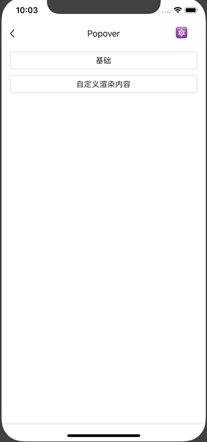

# Popover

弹出框组件。

## Usage

### 全部引入
```
import { Popover } from 'beeshell';
```

### 按需引入
```
import Popover from 'beeshell/dist/components/Popover';
```

## Examples



## Code
[详细 Code](https://github.com/Meituan-Dianping/beeshell/tree/master/examples/Popover/index.tsx)

```jsx
import { Popover } from 'beeshell';

<Popover
  ref={(c) => {
    this._popover = c
  }}>
  注意注意！！！
</Popover>

this._popover.open()
this._popover.open()
```

## API

继承 [SlideModal](./SlideModal.md) 组件的所有 Props、Methods。

### Props

| Name | Type | Required | Default | Description |
| ---- | ---- | ---- | ---- | ---- |
| offsetX | number | false | 0 | 弹出位置 X 轴坐标 |
| offsetY | number | false | screen.height | 弹出位置 Y 轴坐标 |
| direction | string/string[] | false | 'down' | 弹出方向 |
| align | string | false | 'left' | 内容部分所处位置 |
| children | string/ReactChild/ReactChild[] | true | null | 弹出框展示内容 |