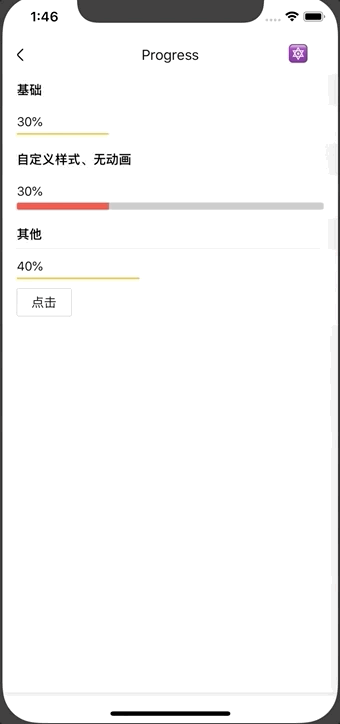

# Progress

进度条组件。

## Usage

### 全部引入
```js
import { Progress } from 'beeshell';
```

### 按需引入
```js
import { Progress } from 'beeshell/dist/components/Progress';
```

## Examples




## Code
[详细 Code](https://github.com/Meituan-Dianping/beeshell/tree/master/examples/Progress/index.tsx)

```jsx
<Progress
  easing={true}
  percent={90}
  barStyle={{ height: 3 }}
/>
```

## API

### Props

| Name | Type | Required | Default | Description |
| ---- | ---- | ---- | ---- | ---- |
| style | ViewStyle | false | null | 样式 |
| barStyle | ViewStyle | false | null | 进度动条的样式，可以通过设置 backgroundColor 来改变动条的颜色 |
| percent | number | false | 0 | 进度条长度百分比 |
| easing | boolean | false | true | 是否启用动画效果 |
| duration | number | false | 300 | 进度条运动时间 |
