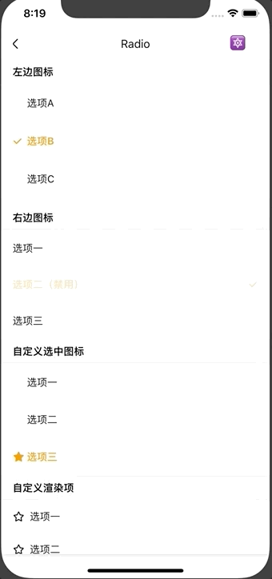

# Radio

单选框组件。

## Usage

### 全部引入
```
import { Radio } from 'beeshell';
```

### 按需引入
```
import { Radio } from 'beeshell/dist/components/Radio';
```

## Examples



## Code
[详细 Code](https://github.com/Meituan-Dianping/beeshell/tree/master/examples/Radio/index.tsx)

```jsx
import { Radio } from 'beeshell'

<Radio
  value={this.state.value}
  onChange={(value) => {
    this.setState({
      value
    })
  }}>

  <Radio.Item label='选项一' value={1} />
  <Radio.Item label='选项二' value={2} />
  <Radio.Item label='选项三' value={3} />
</Radio>
```

## API

### Radio Props
| Name | Type | Required | Default | Description |
| ---- | ---- | ---- | ---- | ---- |
| style | ViewStyle | false | {} | 样式 |
| iconPosition | string | false | 'left' | 图标位置，支持 'left' 'right' |
| checkedIcon | ReactElement | false | `<Icon type='check' />` | 选中的图标 |
| uncheckedIcon | ReactElement | false | `<View />` | 未选中的图标 |
| value | any | false | null | 选中的值，与 Radio.Item 的 value 属性对应 |
| onChange | Function | false | null | 值变化的回调 |
| children | ReactChild/ReactChild[] | false | null | 子元素 |

### Radio.Item Props
| Name | Type | Required | Default | Description |
| ---- | ---- | ---- | ---- | ---- |
| style | ViewStyle | false | {} | 单选项样式 |
| label | string | true | '选项' | 选项文案 |
| value | any | true | null | 选项值 |
| disabled | boolean | false | false | 禁用选项 |
| renderItem | Function | false | null | 自定义渲染项 |
