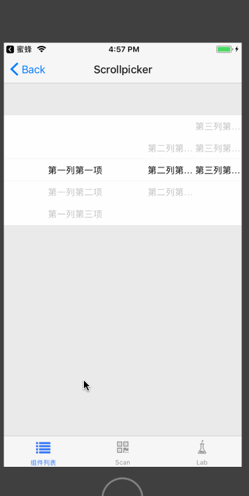

# Scrollpicker

滚动选择组件，纯 JS 实现，自定义数据源，flex 区域占比。该组件只提供滚动选择、布局功能。可以基于此组件更复杂的组件，例如：Datepicker。

## Install

```
npm install beeshell 
```

## Usage

### 引入方式
#### 全部引入
```
import { Scrollpicker } from 'beeshell';
```
#### 单独引入

```
import Scrollpicker from 'beeshell/components/Scrollpicker';
```


### Examples

#### 区域等分


#### 区域比例 3:1:1




### Code

```jsx
import { Scrollpicker } from 'beeshell';

class App extends React.Component {
    render() {
        const list = [
            [ { label: '第一列第一项', value: 1 }, '第一列第二项', '第一列第三项'],
            ['第二列第一项', '第二列第二项', '第二列第三项'],
            ['第三列第一项', '第三列第二项', '第三列第三项'],
        ],
        const proportion = [3, 1, 1];
        const value = [1, 2, 1];

        return (
            <View>
                <Scrollpicker
                    list={list}
                    value={value}
                    proportion={proportion}
                    onChange={(columnIndex, rowIndex) => {
                        console.log(columnIndex, rowIndex);
                    }}
                />
            </View>
        );
    }
}


```

### Props

| Name | Type | Required | Default | Description |
| ---- | ---- | ---- | ---- | ---- |
| list | Array | true | [] | 选择数据源，二维数组，第一层代表列，第二层代表选择项，选择项数据可以是对象（必须包含 label 属性）或者字符串 |
| value | Array | false | [] | 选中的数据的索引，一维数组，每一项对应选择项数据的索引，注意其长度要和数据源长度一致 |
| proportion | Array | false | [] | 分区比例，注意和数据源长度保持一致 |
| onChange | Function | false | null | 数据变化回调，该函数提供两个索引参数，第一个是列索引，第二个是行索引 |
