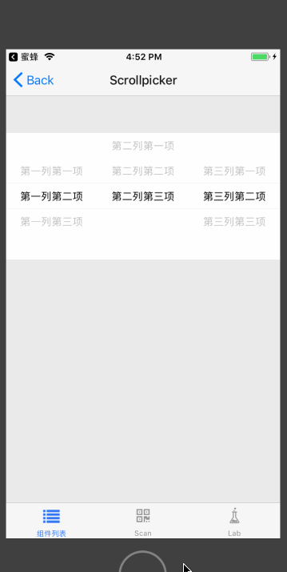
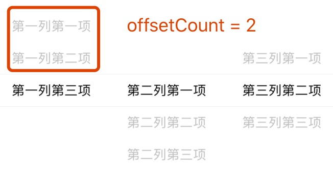
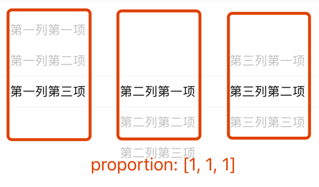

# Scrollpicker

滚动选择组件。纯 JS 模拟滚动选择，跨平台。

## Usage

### 全部引入
```
import { Scrollpicker } from 'beeshell';
```
### 按需引入

```
import Scrollpicker from 'beeshell/dist/components/Scrollpicker';
```

## Examples

**Scrollpicker 与 BottomModal 组合应用**



**相关属性说明**





## Code
[详细 Code](https://github.com/Meituan-Dianping/beeshell/tree/master/examples/Scrollpicker/index.tsx)

```jsx
import { Scrollpicker } from 'beeshell';

<Scrollpicker
  list={[
    [1, 2, 3],
    [1, 2, 3],
    [1, 2, 3]
  ]}
  value={[0, 1, 1]}
  proportion={[2, 1, 1]}
  onChange={(columnIndex, rowIndex) => {
    console.log(columnIndex, rowIndex);
  }}
/>
```

## API

### Props

| Name | Type | Required | Default | Description |
| ---- | ---- | ---- | ---- | ---- |
| style | ViewStyle | false | {} | 样式 |
| list | Array | true | [] | 选择数据源，二维数组，第一层代表列，第二层代表选择项，选择项数据可以是对象（必须包含 label 属性）或者 string、number |
| value | Array | false | [] | 选中的数据，一维数组，数组索引代表 list 列，数组值对应 list 行，所以其长度要和数据源 list 长度一致 |
| proportion | Array | false | [] | 分区比例，注意和数据源长度保持一致 |
| offsetCount | number | false | 2 | 选中项距离顶部的偏移个数 |
| onChange | Function | false | null | 数据变化回调，该函数提供两个索引参数，第一个是列索引，第二个是行索引 |
| renderItem | Function | false | null | 自定义渲染项 |
