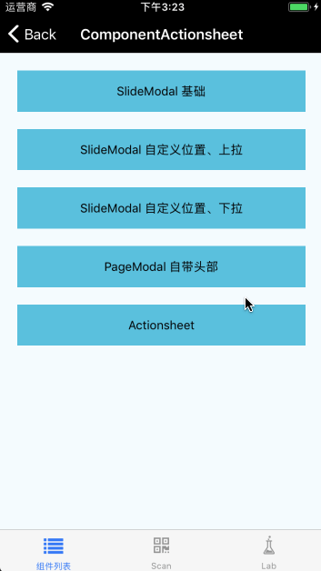

# SlideModal

继承自 [Modal](./Modal.md) 组件，属于 Modal 系列。

## Install

```
npm install @mfe/beeshell --registry=http://r.npm.sankuai.com
```

## Usage

### 引入方式
#### 全部引入
```
import { SlideModal } from '@mfe/beeshell';
```

#### 单独引入
```
import SlideModal from '@mfe/beeshell/components/Modal/extensions/SlideModal';
```


### Examples
#### 基础


弹出内容比较简陋，完全由用户自定义内容。与 Modal 父类的主要区别是样式和动画，样式上位置自定义；动画上是 Slide 效果。

Beeshell 对于动画的部分使用了策略模式来集成，Modal 使用 FadeAnimated 类型，而 SlideModal 则使用了 SlideAnimated 类型。

#### 自定义位置与动画方向



### Code

```jsx
import { SlideModal } from '@mfe/beeshell';

class App extends React.Component {
    render() {
        <View>
            <TouchableOpacity
                onPress={() => {
                    this._slideModal.open();
                }}>
                <Text>基础用法</Text>
            </TouchableOpacity>

            <SlideModal
                    ref={(c) => { this._slideModal = c; }}
                    cancelable={true}>

                    <View>
                        <Text>ref 获取组件实例</Text>
                        <Text>
                            cancelable={'{'}true{'}'}
                            点击蒙层消
                        </Text>
                    </View>
                </SlideModal>
        </View>
    }
}


```

### Props

| Name | Type | Required | Default | Description |
| ---- | ---- | ---- | ---- | ---- |
| cancelable | Boolean | false | true | 点击蒙层是否消失 |
| offsetX | Number | false | 0 | 距离屏幕左边距离，默认是 0|
| offsetY | Number | false | Dimensions.get('window').height | 距离屏幕顶部距离，默认是屏幕的高度，即从底部弹出 |
| compatStatusBarCurrentHeight | Boolean | false | false | 是否兼容状态栏高度，根据实际情况配置 |
| width | Number | false | null | 弹出内容的宽度，默认根据子元素内容而定 |
| direction | String | false | 'up' | 动画的方向 'up' 上拉，'down' 下拉 |

### Methods
#### .open()

打开弹窗。

```
    this._slideModal.open();
```

#### .close()

关闭弹窗。

```
    this._slideModal.close();
```

### 其他

继承 [Modal](./Modal.md) 组件的所有 Props、Methods。
