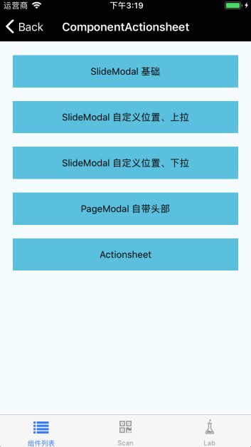
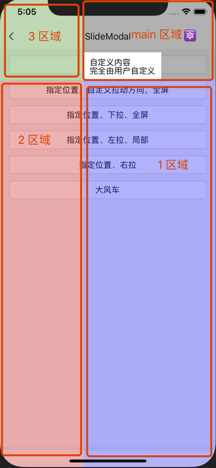
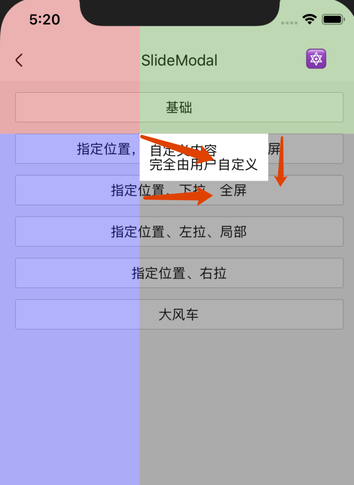
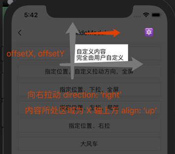
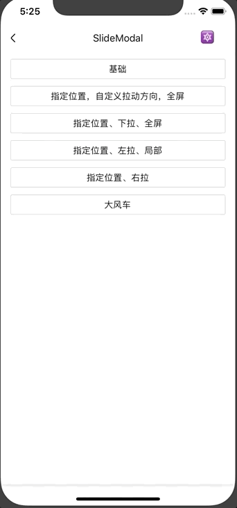

# SlideModal

滑动弹框。支持四个触控区域，十二个动画方向。


## Usage

### 全部引入
```js
import { SlideModal } from '@roo/roo-mobile-rn';
```

### 按需引入
```js
import SlideModal from '@roo/roo-mobile-rn/dist/components/SlideModal';
```

## Examples

**基础**



**四个触控区域**

main 区域是内容所在区域，带有遮罩，无法点击遮罩下面元素。

从 main 区域开始，顺时针顺序，分别为 1、2、3 区域，这三个区域可以配置是否能点击下面元素，通过 fullScreenPatch（全屏补丁）属性进行配置，是一个数组，默认值为 [false, false, false]，代表三个区域都可以击穿。如果某个配置为 true，并且 cancelable 属性也为 true，则点击该区域弹框关闭。

默认情况下，三个区域的遮罩样式与 main 区域一致，这里为了方便说明，使用了不同的颜色。如下图所示：



**动画方向**

指定一个弹出位置（offsetX、offsetY），可以分成四个区域，每个区域有三个方向的动画。如图：



**内容区域所处位置**

direction 与 align 属性配合使用。



**整体效果**



## Code

```jsx
import { SlideModal } from '@roo/roo-mobile-rn';

<SlideModal
  ref={(c) => { this._slideModal = c; }}
  cancelable={true}>
  <View>
    <Text>
      自定义内容
    </Text>
  </View>
</SlideModal>

this._slideModal.open()
this._slideModal.close()
```

## API

继承 [Modal](./Modal.md) 组件的部分 Props、Methods。

### Props

| Name | Type | Required | Default | Description |
| ---- | ---- | ---- | ---- | ---- |
| offsetX | number | false | 0 | 弹出位置 X 轴坐标 |
| offsetY | number | false | screen.height | 弹出位置 Y 轴坐标 |
| direction | string/string[] | false | 'up' | 动画的方向，值为 'up' 'down' 'left' 'right' ['up', 'left' ] 等 |
| align | string | false | 'right' | 内容部分所处的位置。详情见 Examples |
| fullScreenPatch | boolean[] | false | [false, false, false] | 全屏补丁，配置区域是否可以击穿。详情见 Examples |
| children | ReactChild/ReactChild[] | true | null | 弹框内容 |