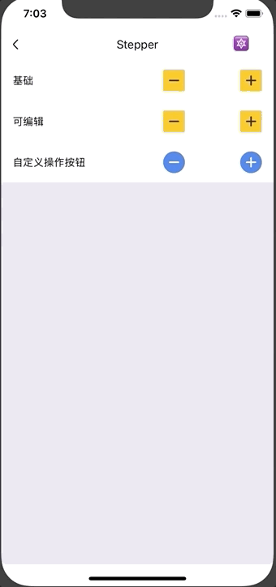

# Stepper

计数器组件。

## Usage

### 全部引入
```
import { Stepper } from 'beeshell';
```

### 按需引入
```
import Stepper from 'beeshell/dist/components/Stepper';
```

## Examples



## Code

[详细 Code](../../examples/Stepper/index.tsx)

```jsx
<Stepper
  min={1}
  max={5}
  value={1}
  onChange={(value, oldValue, action) => {
    console.log(value, oldValue, action)
  }}
/>
```

## API

### Props

| Name | Type | Required | Default | Description |
| ---- | ---- | ---- | ---- | ---- |
| style | ViewStyle  | false | {} | 样式 |
| operatorStyle | ViewStyle  | false | {} | 操作按钮样式 |
| operatorIconColor | string  | false | variables.mtdGrayDarker | 操作按钮图标颜色 |
| max | number | false | 5 | 最大值 |
| min | number | false | 1 | 最小值 |
| value | number | false | null | 当前值 |
| step | number | false | 1 | 步长 |


|step | number | no | 1 | 添加间隔  |
|editable | number | no | false | 中间的输入框是否可编辑 |

### 可修改的模块样式
| Property | Type | Description |
| ---- | ---- | ---- |  
| styles |  | 全局的样式替换，注意：若替换需要时全局的 |
| containerStyle | ViewStyle | 容器样式 |
| ctrlStyle | ViewStype | 加减号容器样式 |
| ctrlSymbolStyle | ViewStyle | 加减符号样式 |
| inputStyle | ViewStyle | 中间输入区样式 |

### 事件

| Name | Type | Required | Default | Description |
| ---- | ---- | ---- | ---- | ---- |
| onChange | Function(value, oldValue, action) | yes | | 接受修改的值。并重置value的值 action: "increase"/"decrease" |
| onOutOfRange | Function | no | | 当超过范围的时候抛出的事件 |


 

