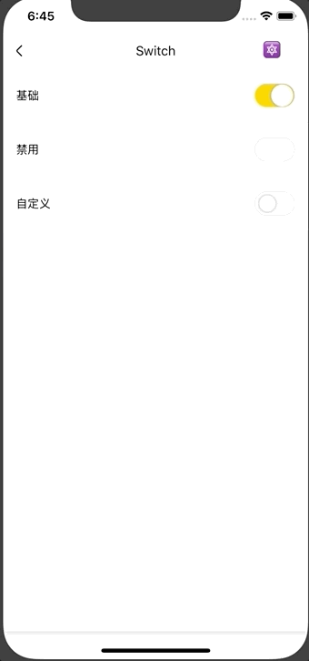

# Switch

开关组件。

## Usage
### 全部引入

```js
import { Switch } from 'beeshell';
```

### 按需引入
```js
import { Switch } from 'beeshell/dist/components/Switch';
```

## Examples



## Code
[详细 Code](https://github.com/Meituan-Dianping/beeshell/tree/master/examples/Switch/index.tsx)

```js
import { Switch } from 'beeshell';

<Switch value={this.state.valueA} onChange={(value) => { this.setState({ valueA: value }) }}/>

```

## API
### Props

| Name | Type | Required | Default | Description |
| ---- | ---- | ---- | ---- | ---- |
| style | ViewStyle | false | {} | 样式 |
| value | boolean | false | false | 状态值 |
| disabled | boolean | false | false | 是否可以切换状态 |
| rockerSize | string | false | 'lg' | 滑块的尺寸，支持 'lg' 'sm' |
| activeColor | string | false | variable.mtdBrandPrimary | 打开状态颜色 |
| onChange | Function | false | null | 值变化回调 |