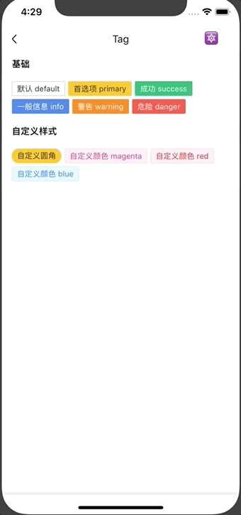

# Tag

标签组件。

## Usage

### 全部引入
```
import { Tag } from 'beeshell';
```

### 按需引入
```
import Tag from 'beeshell/dist/components/Tag';
```

## Examples



## Code

[详细 Code](https://github.com/Meituan-Dianping/beeshell/tree/master/examples/Tag/index.tsx)

```jsx
<Tag style={{ marginRight: 5, marginBottom: 5 }} type='default'>默认 default</Tag>
<Tag style={{ marginRight: 5, marginBottom: 5 }} type='primary' textColorInverse>首选项 primary</Tag>
<Tag style={{ marginRight: 5, marginBottom: 5 }} type='success'>成功 success</Tag>
<Tag style={{ marginRight: 5 }} type='info'>一般信息 info</Tag>
<Tag style={{ marginRight: 5 }} type='warning'>警告 warning</Tag>
<Tag style={{ marginRight: 5 }} type='danger'>危险 danger</Tag>
```

## API

### Props

| Name | Type | Required | Default | Description |
| ---- | ---- | ---- | ---- | ---- |
| style | ViewStyle | false | {} | 样式 |
| textStyle | TextStyle | false | {} | 文本样式 |
| type | string | false | 'default' | 类型，支持 'default' 'primary' 'danger' 'info' 'success' 'warning' |
| textColorInverse | boolean | false | false |  文本反色 |
