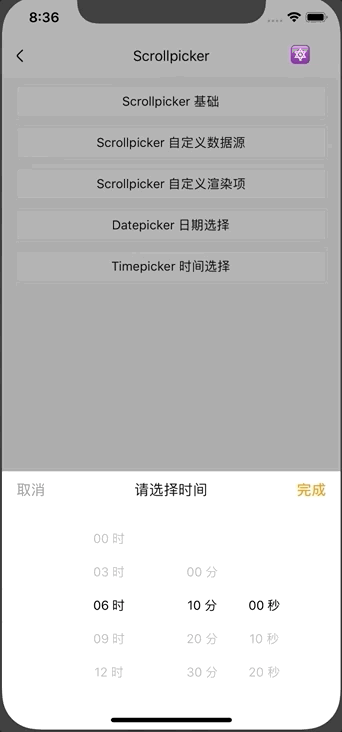

# Timepicker

时间选择组件。滚动选择交互，基于 Scrollpicker 实现。

## Usage

### 全部引入
```js
import { Timepicker } from '@roo/roo-mobile-rn';
```
### 按需引入

```js
import Timepicker from '@roo/roo-mobile-rn/dist/components/Timepicker';
```

## Examples
**Timepicker 与 BottomModal 组合应用**



## Code
[详细 Code](https://github.com/Meituan-Dianping/beeshell/tree/master/examples/Timepicker/index.tsx)

```jsx
import { Timepicker } from '@roo/roo-mobile-rn';

<Timepicker
  style={{ paddingHorizontal: 50 }}
  proportion={[2, 1, 1]}
  hourStep={3}
  minuteStep={10}
  secondStep={10}
  value={null}
  onChange={(value) => {
    console.log(value)
  }}
/>
```

## API

### Props

| Name | Type | Required | Default | Description |
| ---- | ---- | ---- | ---- | ---- |
| style | ViewStyle | false | {} | 样式 |
| hourStep | number | false | 1 | 时步长 |
| minuteStep | number | false | 1 | 分步长 |
| secondStep | number | false | 1 | 秒步长 |
| value | string | false | null | 选定的时间字符串，'HH:mm:ss' 格式 |
| onChange | Function | false | null | 数据变化回调|

组合使用 [Scrollpicker](./Scrollpicker.md) 组件，透传 Scrollpicker 所有 Props
