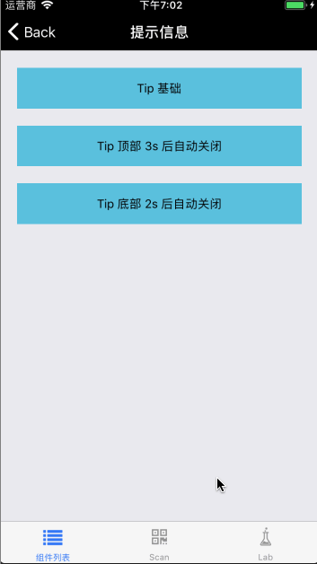

# Tip

继承自 [Modal](./Modal.md) 组件，属于 Modal 系列。


## Install

```
npm install @mfe/beeshell --registry=http://r.npm.sankuai.com
```

## Usage

### 引入方式
#### 全部引入
```
import { Tip } from '@mfe/beeshell';
```

#### 单独引入
```
import Tip from '@mfe/beeshell/components/Modal/extensions/Tip';
```

### Examples


### Code

```jsx
import { Tip } from '@mfe/beeshell';

class App extends React.Component {
    render() {
        <View>
            <TouchableOpacity
                onPress={() => {
                    this._tip.open();
                }}>
                <Text>基础用法</Text>
            </TouchableOpacity>

            <Tip
                ref={(c) => { this._tip = c; }}
                cancelable={true}
                body="默认文案"
            />
        </View>
    }
}


```

### Props

| Name | Type | Required | Default | Description |
| ---- | ---- | ---- | ---- | ---- |
| cancelable | Boolean | false | true | 点击蒙层是否消失 |
| body | String | false | 'hello world' | 提示文案 |
| alignItems | String | false | 'center' | 组件展示位置，`flex-start` 顶部 `flex-end` 底部 `center` 中部 |
| duration | Number | false | null | 弹出后在 duration 指定的毫秒数后自动关闭，未指定则不会自动关闭 |

### Methods

#### .open()

打开弹窗。

```
this._tip.open();
```

#### .close()

关闭弹窗。

```
this._tip.close();
```

### 其他

继承 [Modal](./Modal.md) 组件的所有 Props、Methods。
