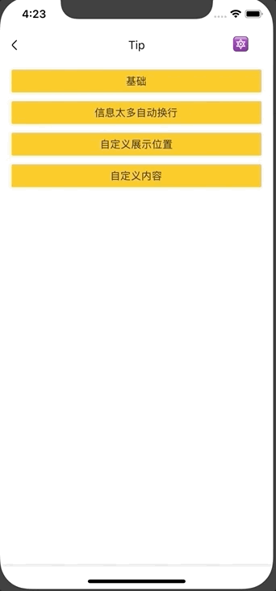

# Tip

全局提示组件。

## Usage

### 全部引入
```
import { Tip } from 'beeshell';
```

### 按需引入
```
import { Tip } from 'beeshell/dist/components/Tip';
```

## Examples



## Code
[详细 Code](https://github.com/Meituan-Dianping/beeshell/tree/master/examples/Tip/index.tsx)

```jsx
import { Tip } from 'beeshell';

// 方式一： API 调用
Tip.show('提示信息！', 2000, 'center')

// 方式二：标签调用
<Tip
  ref={(c) => { this._tip = c; }}
  cancelable={true}
  body='Hello world!'
/>
this._tip.open()
this._tip.close()

```

## API

继承 [Modal](./Modal.md) 组件的所有 Props、Methods。

### Props

| Name | Type | Required | Default | Description |
| ---- | ---- | ---- | ---- | ---- |
| body | string/ReactElement | false | 'hello world' | 内容区域，支持字符串或者 ReactElement。可以通过提供一个 ReactElement 任意自定义  |
| duration | number | false | null | 弹框存在时长，弹出后在 duration 指定的毫秒数后自动关闭，未指定则不会自动关闭 |
| position | string/string[] | false | 'center' | 弹框展示位置，支持字符串与数组，例如：'top' 'center' ['top', 'left'] 等 |

### Methods

#### .show(msg: string, duration?: number, cancelable?: boolean, position?: string | string[])

这是一个类方法（静态方法）。

```
Tip.show('信息提示！')
```

**参数**

| Name | Type | Required | Default | Description |
| ---- | ---- | ---- | ---- | ---- |
| msg | string | true | null | 展示文案 |
| duration | number | false | 2000 | 在多少毫秒后自动消失 |
| cancelable | boolean | false | true | 点击空白处是否关闭 |
| position | string/string[] | false | 'center' | 同上 |
