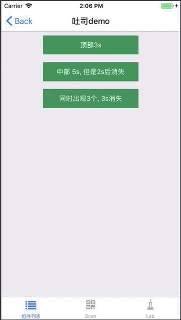

# Toast

是对 [Tip](./Tip.md) 组件封装，使用 API 而不是标签的方式调用。

## Install

```
npm install beeshell
```

## Usage

### 引入方式
#### 全部引入
```
import { Toast } from 'beeshell';
```

#### 单独引入
```
import Toast from 'beeshell/modules/Toast';
```


### Examples
#### 基础



### Code

```jsx
import { Toast } from 'beeshell';

class App extends React.Component {
    render() {
        <View>
            <TouchableOpacity
                onPress={() => {
                    Toast.show('在顶部，3s 后自动消失，我比较长会自动换行自动换行自动换行自动换行', 3000, 'top');
                }}>
                <Text style={styles.btnText}>点击</Text>
            </TouchableOpacity>
        </View>
    }
}
```


### Props

| Name     | Type   | Required | Default| Description|
| -------- | ------ | -------- | ------------------- | -------------------------------------------- |
| msg      | String | false    | 'hello world'       | 提示文案|
| duration | Number | false    | 2000                | 弹出后在 duration 指定的毫秒数后自动关闭 |
| posotion | String | false    | 'center' |显示位置，值为：`'center'` `'top'` `'bottom'`|


### Methods

#### .show(msg, duration, positon)

显示提示信息。

```
Toast.show('操作成功');
Toast.show('顶部 3s 自动消失 我比较长会自动换行自动换行自动换行自动换行', 3000, 'top');
Toast.show('中部 5s', 5000, 'center');
```

#### .hide()
隐藏提示信息。

```
Toast.hide();
```

Toast 是单例，是对 Tip 组件的封装，Toast 每调用一次 show 就会实例化一个 Tip 类型对象，Toast.hide 方法只能隐藏最后一个 Tip 对象，所以 Toast.show 显示的内容都会延时自动隐藏。

