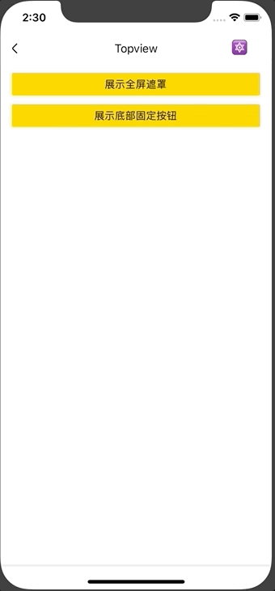

# Topview

顶层视图组件。

该组件的实例（而且是单例），是 RN UI 树的根节点的兄弟节点，因为 RN 没有 fixed 定位，所以通过 Topview 单例可以实现 fixed 定位功能。

Modal、SlideModal 等弹框类组件，底层都依赖该组件，支持全屏、半屏、多个弹框。

## Usage
### 全部引入

```js
import { TopviewGetInstance } from '@roo/roo-mobile-rn';
```

### 按需引入
```js
import { TopviewGetInstance } from '@roo/roo-mobile-rn/dist/components/Topview';
```

## Examples



## Code
[详细 Code](https://github.com/Meituan-Dianping/beeshell/tree/master/examples/Topview/index.tsx)

```js
import { TopviewGetInstance } from '@roo/roo-mobile-rn';

TopviewGetInstance().add(
  <View style={{ position: 'absolute', top: 0, left: 0 }} ><Text>自定义内容</Text></View>
).then((id) => {
  console.log(id)
})

TopviewGetInstance().remove(id)

```

## API
### Methods

#### TopviewGetInstance()

获取 Topview 组件单例。

#### add(component: ReactElement, args?: any)

添加元素。参数包括一个 ReactElement 类型参数 component 和配置对象 args。返回一个 Promise 对象，返回结果是元素的唯一标志 id，可以通过这个 id 来删除该元素。

```js
TopviewGetInstance().add(<Text>自定义内容</Text>).then((id) => {
  console.log(id)
})
```

#### remove(id: number)

删除元素。参数为添加元素返回的 id。返回一个 Promsie 对象。

```js
TopviewGetInstance().remove(id).then(() => {
  // 删除成功
})
```