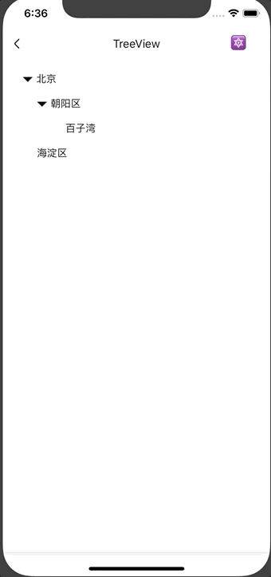

# TreeView

树形结构组件。

## Usage
### 全部引入

```js
import { TreeView } from '@roo/roo-mobile-rn';
```

### 按需引入
```js
import { TreeView } from '@roo/roo-mobile-rn/dist/components/TreeView';
```

## Examples



## Code
[详细 Code](../../examples/TreeView/index.tsx)

```js
import { TreeView } from '@roo/roo-mobile-rn';

const nestedData = [
  {
    label: '北京',
    id: 'beijing',
    children: [
      { label: '朝阳区', id: 'chaoyangqu', children: [{ label: '百子湾', id: 'baiziwan' }] },
      { label: '海淀区', id: 'haidianqu' }
    ]
  }
]

const flattenedData = [
  { label: '北京', id: 'beijing' },
  { label: '朝阳区', id: 'chaoyangqu', pId: 'beijing' },
  { label: '百子湾', id: 'baiziwan', pId: 'chaoyangqu' },
  { label: '海淀区', id: 'haidianqu', pId: 'beijing' }
]

<TreeView
  data={nestedData}
  dataStructureType='nested'
  onPress={(item) => {
    console.log(item)
  }}
/>

<TreeView
  data={flattenedData}
  dataStructureType='flattened'
  onPress={(item) => {
    console.log(item)
  }}
/>

```

## API
### Props

| Name | Type | Required | Default | Description |
| ---- | ---- | ---- | ---- | ---- |
| style | ViewStyle | false | {} | 按钮样式 |
| activeIcon | ReactElement | false | <Icon type='angle-down' /> | 激活状态图标 |
| inactiveIcon | ReactElement | false | <Icon type='angle-right' /> | 未激活状态图标 |
| data | any[] | false | [] | 数据源，支持嵌套和扁平的树形结构 |
| dataStructureType | string | false | 'nested' | 数据结构类型，支持 'nested' 'flattened' |
| fieldKeys | any | false | {} | 数据项的 key 自定义，包括 idKey pIdKey childrenKey activeKey |
| onPress | Function | false | null | 点击某项回调，参数为点击项 |