# React Native 组件库 beeshell 升级 2.0

## 引言

随着 React Native（以下简称 RN） 技术在公司的全面推广，各个业务方都出现了对 RN 组件库的诉求。公司内部发起了 RN 组件库建设，旨在提供公司级共用的 RN 组件库。如何提供一套通用的组件库，来有效的支撑包括外卖、酒旅以及其他事业部的所有业务需求？这对组件库的架构设计、UI 一致性、易用性、扩展性提出了更高的要求。因为我们团队在开发 beeshell 1.0 时积累了宝贵的经验，所以被邀请加入到公司级 RN 组件库的项目共建中，在开发完公司级组件库后，我们将共建的成果贡献出来，在服务社区的同时，也想借助社区的力量进一步完善组件库。

beeshell 2.0 的效果图如下：

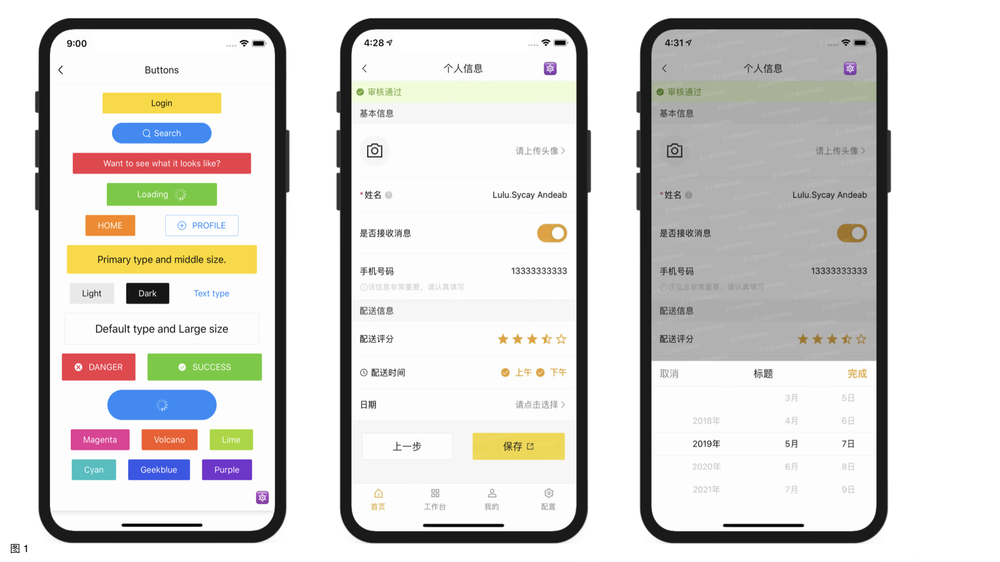

## 系统设计升级

### 架构

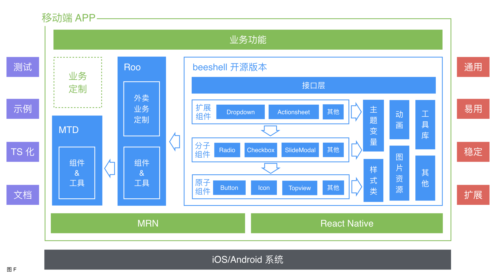

### 协作模式

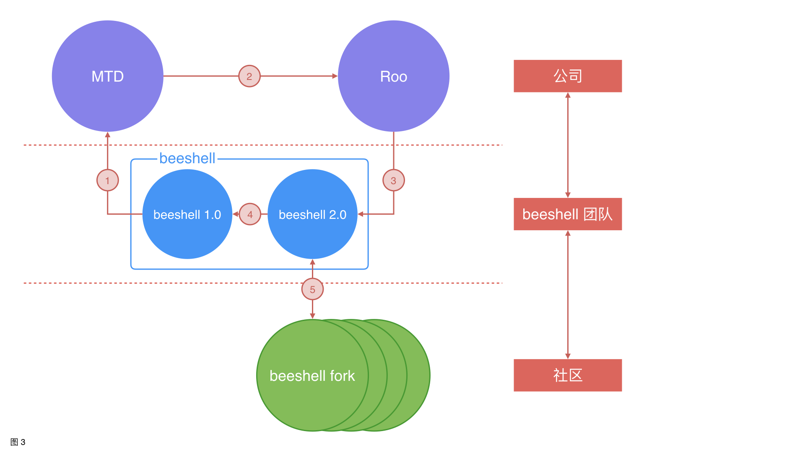

## 方案实现优化
### UI 风格一致性

UI 风格的一致性，包括样式一致性和动效一致性。

#### 样式一致性

样式一致性，又可以细分为色彩和排版。

首先，介绍下色彩部分。在 APP 应用中，色彩元素扮演的角色仅次于功能。 人与计算机的互动，主要是与图形用户界面（GUI）的交互，而色彩在该交互中起着关键作用。 它可以帮助用户查看和理解界面内容，与正确的元素互动，并了解相关操作。每个 APP 都会有一套配色方案，并在主要区域使用其基础色彩。

正因为有无数种色彩组合的可能，在设计一个 APP 时，人们的配色方案也有无数种选择。本文不纠结于如何选择一个好的配色方案，而是介绍一个配色方案应该具有哪些元素。

一套完整的配色方案，应该包括品牌主色、品牌功能色、中性色。本文以 beeshell 的配色方案举例说明。

*色彩：品牌主色*

品牌主色应该是应用中出现最频繁的颜色，通常用来强调 UI 中的关键部分的颜色。beeshell 的品牌主色色值为 `#fecb2e`，如下图所示：

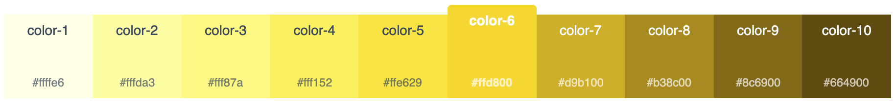

有时，一个品牌主色并不能够支撑所有的应用场景，此时，可以通过加深或者变浅主色的方式，再增加几个色值，beeshell 的品牌主色还包括一个加深的色值 `#ffa000`，用于某些组件的激活状态，如下图所示：

*色彩：品牌功能色*

功能色的内容与使用场景如下图所示：

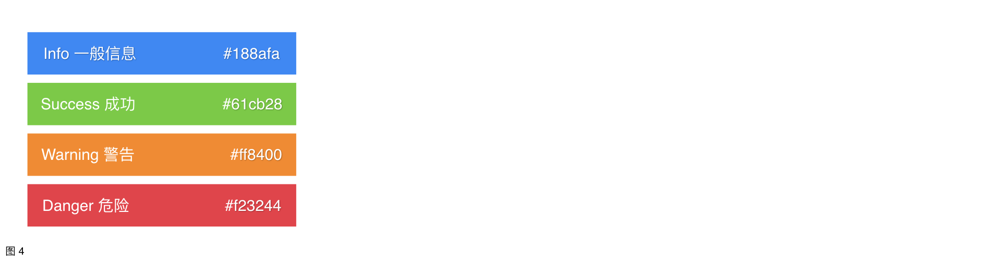

*色彩：中性色*

中性色（灰度）的内容与使用场景如下图所示：

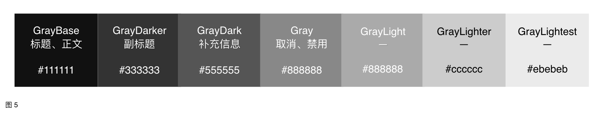

然后，介绍排版，排版包括字体、间距、边线。

*排版：字体*

beeshell 的字体尺寸（Font Size）集，是基于 12、14、16、20 和 28 的排版比例，如下图所示：

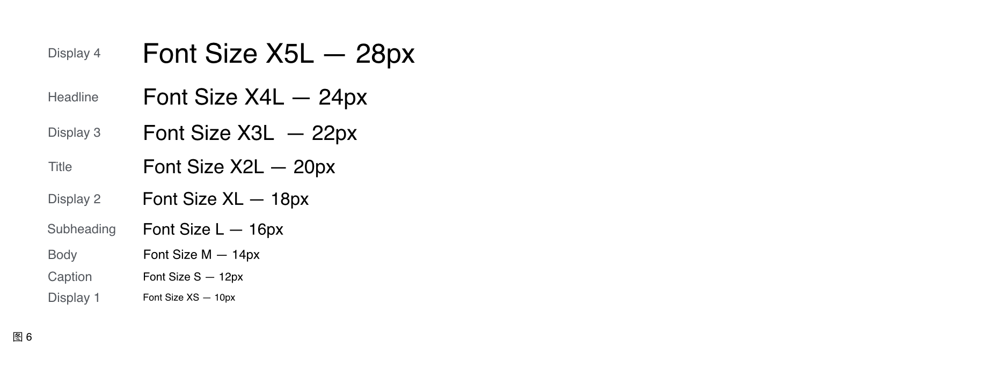

对于字重（Font Weight），只使用正常 `normal` 和加粗`bold` 两种，避免了因为不同字体家族（Font Family），对字重的支持范围不同，而导致视觉差异。

除了字体尺寸和字重，影响排版的还有字体行高（Line Height）。为了达到适当的可读性和阅读流畅性，字体行高，需要根据字体的大小和粗细来设定。经过测试，RN 应用在默认情况下，行高约等于字体大小乘以 1.2，如下图所示：

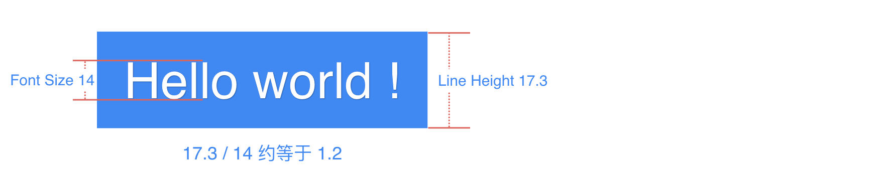

> 注意：对于中文字体，行高与字体尺寸的比例并不是 1:1.2。

*排版：间距*

间距是 UI 元素与元素之间、父元素与子元素之间的空白区域，一个应用排版风格一致性，很大程度取决于间距。一个组件的最终宽高，应该由内容、内边距决定，是自适应的，而不应该直接定义宽高。

对于同一个 APP，间距应该在一个合适的范围取值，通过定义『小号间距』、『中号间距』、『大号间距』等来划分信息层次。beeshell 的 Button 组件，有三种尺寸，实现如下图所示：

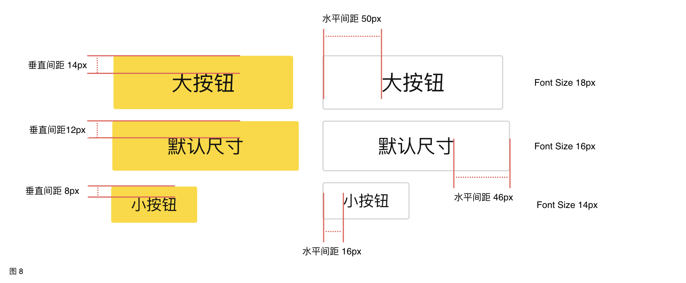

*排版：边线*

边线（边框）部分，需要统一元素的边框宽度、颜色和圆角，边线虽然对 UI 风格的影响较小，但是不可或缺。beeshell 使用的边框宽度为一个物理像素，使用 RN 提供的 `StyleSheet.hairlineWidth` 接口实现；定义了三种灰度的边框颜色；主要使用 2px 的圆角。

样式的一致性，还涉及到图标、布局等内容，这里不做详细介绍，如有需要可以参考 MATERIAL DESIGN。 

#### 动效一致性

动效展示了应用的组织方式和功能。

动效可以：

- 引导用户在视图中的视觉焦点
- 提示用户完成手势操作后会发生什么
- 暗示元素间的等级和空间关系
- 让用户忽视系统背后发生的事情（比如抓取内容、或加载下一个视图）
- 使应用更有个性、更优雅、更令人愉悦

beeshell 组件库基于 Animated 进行了二次封装，提供 FadeAnimated 和 SlideAnimated 两个动画类，支持淡入淡出动画和滑动动画，可以使用策略模式集成到任何组件中。

beeshell 将逐渐在所有的组件集成这两种动画，保证动效的一致性，下文展示下已经实现了动画的组件，先睹为快。

Button 组件使用 FadeAnimated 类实现动画，动效如下图所示：

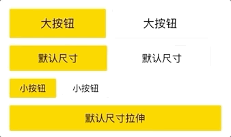

Modal 组件使用 FadeAnimated 类实现动画，动效如下图所示：

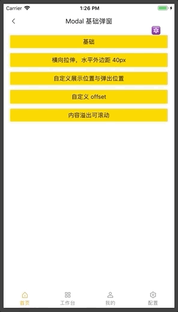

Dropdown 组件使用 SlideAnimated 类实现动画，动效如下图所示：

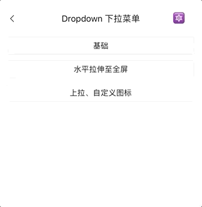

综上所述，beeshell 通过样式和动效两个方面，进行 UI 一致性的优化。样式一致性的保证，主要通过定义全局性的主题变量，供所有组件使用，同时，提供了自定义主题变量的接口，可以实现一键换肤（下文图 9）。动效的一致性，一方面，依赖主题变量中定义的动画开关变量，主要考虑到一些低端 Android 机器的性能问题，用户可以选择性关闭某个组件的动画，另一方面，依赖组件库的良好分层设计，将动画类独立实现，可以使用策略模式，方便的集成到任意组件中。

一键换肤的效果如下图所示：

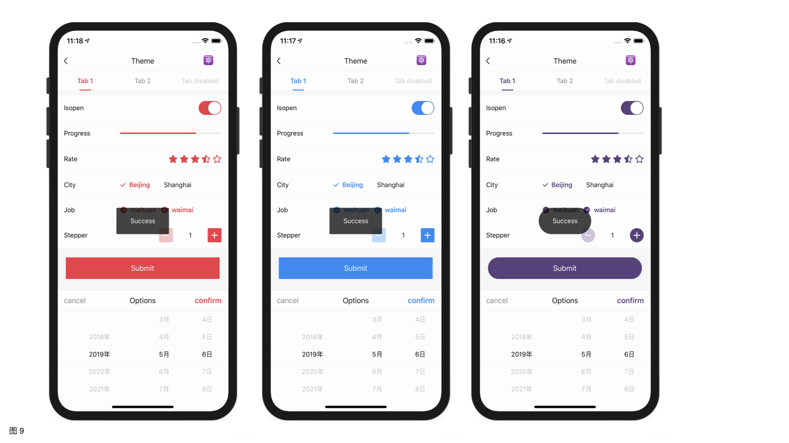

### 定制化能力分级设计

要开发全公司共用的组件库，需要满足酒旅、外卖 C 端、外卖 B 端以及外卖 M 端等等业务需求，这对定制化能力提出了更高的要求。为了进一步增强组件的定制化能力，同时，避免属性的无节制增加，进而导致组件难以维护，我们设计了分级的策略。这里以 BottomModal 为例来详细说明，如下图所示：

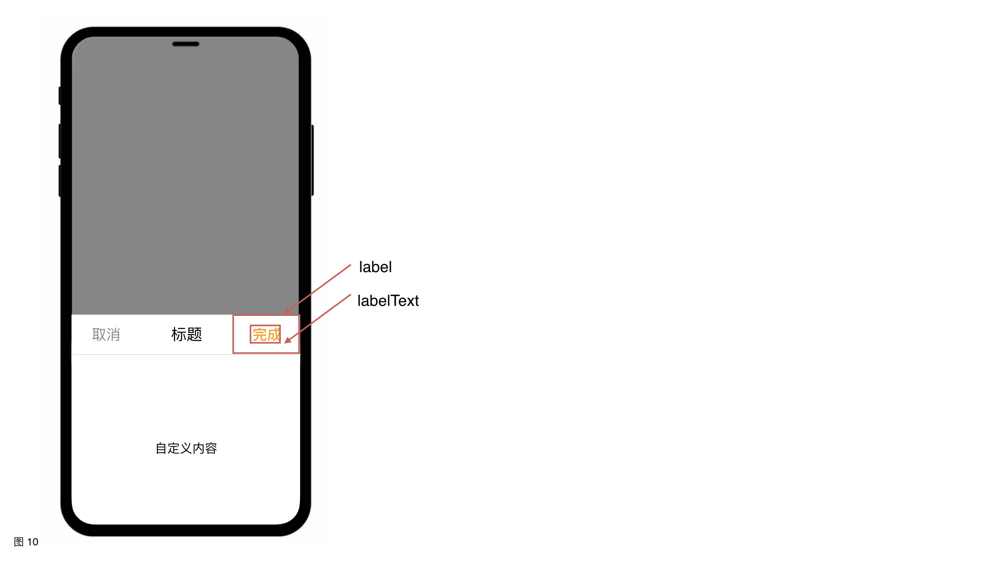

#### 第一级定制化，定制主题变量

”完成“文本的颜色，使用的是主题变量定义的品牌主色（Brand Primary Dark），beeshell 默认的品牌主色为黄色。通过组件库提供的自定义主题变量的接口，可以修改品牌主色的色值，进而修改了”完成“文本的颜色。修改品牌主色，影响范围很大，所有组件的色彩风格统一变化，如果我只想把文本的颜色改成红色，但是并不想修改品牌主色，应该如何定制呢？可以使用第二级定制化。

#### 第二级定制化，提供定制属性

这里提供 labelText 和 labelTextStyle 属性，代码实现为 `<Text style={this.props.labelTextStyle}>{this.props.labelText || '完成'}</Text>`。

labelText 用于定制文案，将 labelTextStyle 整体暴露出来，而不是只暴露颜色单个属性，这样的好处有两点：

- 开发者都熟悉 style 这个名称与用法，但并不知道 xxxColor 是什么，组件更加易用。
- style 不仅可以定制 color，还支持 fontSize、fontWeight 等属性，定制能力更强。

到这里，产品又想出了一个性化需求，要在 label 这个区域放两行文字、一个图标。

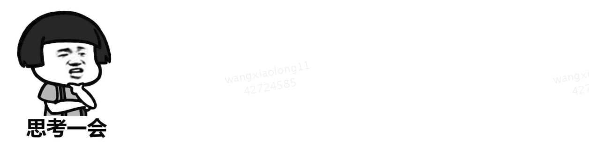

这个需求虽然比较新（恶）颖（心），但是难不倒我的，可以使用第三级。

#### 第三级定制化，开放渲染区域

提供 labe 属性，属性值为一个 ReactElement，任意定制 UI，实现效果如下：

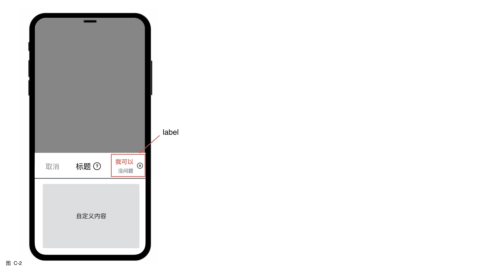

到这里，足以应付一个产品的需求了，突然有一天，来了一个新产品，提了一个新需求：标题和按钮左右布局，不要头部区域的底部边框。

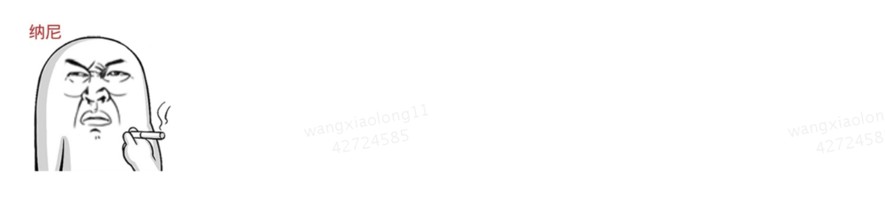

我觉得产品的需求，还是挺合理的，虽然心里有一百个不乐意。如果再提供几个属性，用于定制布局、头部边框，按照这种方式，属性会无节制增加，势必造成组件难以维护和使用。最后我使出了第四级。

#### 第四级定制化，继承/组合基类

在 beeshell 1.0 的开源推广文章中也有讲到过，我们在组件库开发之初，对常见组件，进行了全面的梳理，在比较细的粒度，对组件进行拆分，以继承的方式，层层依赖，以功能渐进式增强的方式，实现各个组件。这样使得开发者，可以在任意层级上继承、组合组件，进行定制化开发，提供了极强的扩展能力。

首先，组件库实现一个 SlideModal 组件，这是一个比较底层的组件，功能相对少，支持多个方向的滑动动画，内容完全由开发者自定义，定制化能力极强。实现效果如下：

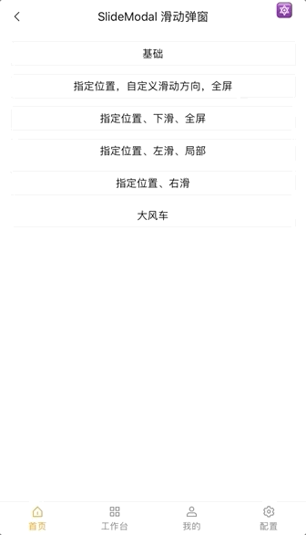

然后，组件库实现了 BottomModal 组件，继承 SlideModal，固定滑动的方向和开始位置，弹框内容横向拉伸至全屏、纵向自适应，功能增强而定制化能力减弱。实现效果如下：

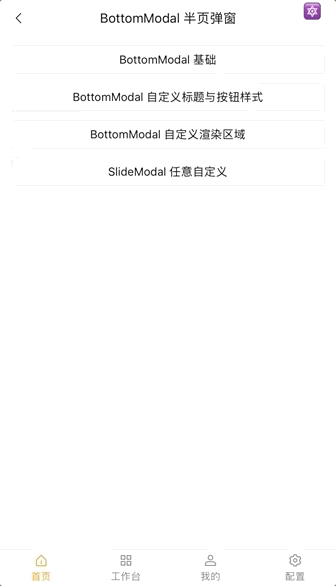

前文已经讲到，产品需求已经超出了 BottomModal 定制化的能力，强行实现只会带来不良后果。所以，我的方式是组合使用 SlideMdoal，开发一个新的组件，也就是第四级定制化。新组件的实现效果如下：

第四级定制化，是使用了新的思路，不再盲目的增加一个组件的功能，来帮助开发者满足产品需求，而是提供了基础工具，基础工具实现了底层、复杂的部分，表现层的部分则让渡给开发者，用户自己实现，授人以鱼不如授人以渔。

通过四个级别的定制化的能力，轻松搞定所有的产品的需求。

### 功能丰富强大

功能丰富强大，通过两个方面体现：一个是组件数量丰富，一个是单个组件的能力强大。

beeshell 目前已提供的功能有 38（组件 33、基础工具 5）个，并且详细规划了另外的 15+ 组件，会陆续开源，在组件数量上有极大优势，同时，支持功能的全部引入和按需引入，可以避免打包过多无用代码。

单个组件应该具备哪些能力？对于常见的组件，我们参考业界的标杆项目，与其保持一样的能力，例如，antd 的 Slider 组件，支持横向和纵向滑动，beeshell 也会支持。对于业务下沉组件，都通过了多个业务场景的验证，组件的稳定性、支撑业务的能力都无可挑剔。我们通过参考标杆、多业务场景验证来保证组件的强大能力。

#### 组件能力展示

SlideModal 滑动弹框组件，支持 12 个滑动方向，支持 4 个触控区域，组件实现原理分析如下图所示：

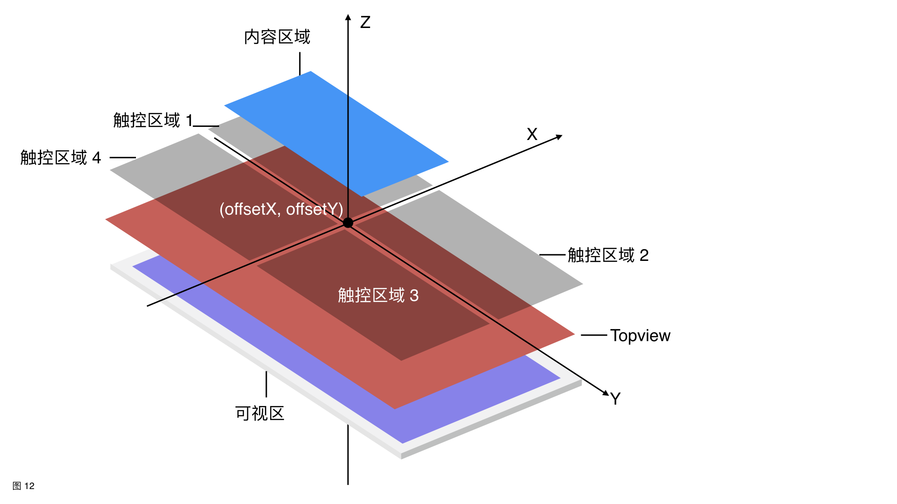

实现 SlideModal 有几个难点：

- 固定定位（position fixed），即相对屏幕来定位。
- 动画开始位置与方向
- 屏幕的局部与全部覆盖

在 RN 中并没有固定定位的概念，这使得相对屏幕来定位难以实现，要实现弹框交互，就必须解决固定定位的难题。beeshell 采取在根元素添加一个兄弟节点（RootSiblings）的方式，实现了 Topview 组件，Topview 实例（图 12 的红色部分）在初始化后，会覆盖在所有页面元素的上方，其 zIndex 可以自定义，默认值为 100，同时实例只是作为布局容器，并不会阻断交互，基于 pointerEvents 属性实现。SlideModal 作为 Topview 实例的子元素，进行展示、布局与交互，图 12 红色部分之上的部分就是 SlideModal 组件，包含 4 个触控区域以及弹框内容区域。

动画的开始位置，通过提供 offsetX 和 offsetY 属性即可，但在指定开始位置后，滑动的方向情况比较多，一共有 12 个方向，如下图所示：

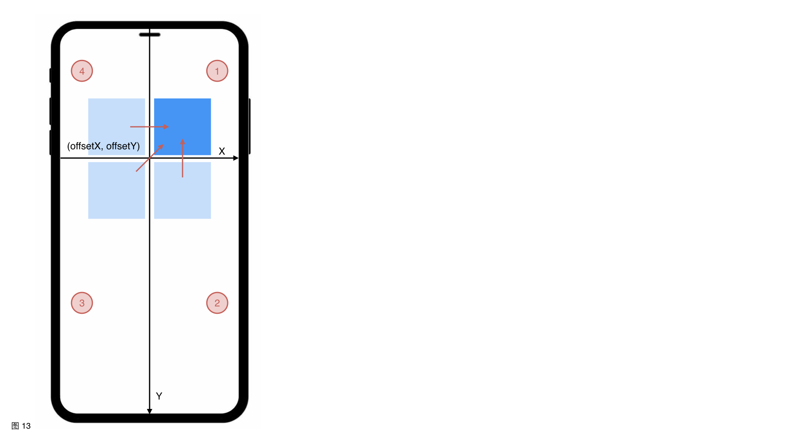

在一个区域中有 3 个方向，4 个区域共 12 个方向。

内容区域的 Z 方向向下一层，是触控区域 1（结合图 12 和 13 理解），也就是我们常说的遮罩（Backdrop），通常要求在点击遮罩时关闭弹框。然而，对于触控区域 2、3、4，是否有遮罩层，则要根据应用场景来定，所以，SlideModal 提供了相关属性可以分别定制这三个区域的交互行为。如果设置三个区域都有遮罩层，则屏幕全部覆盖，无法与弹框之下的元素交互，否则屏幕局部覆盖，在没有遮罩的区域可以击穿弹框。

SlideModal 效果图如下：

除了 SlideModal 还有其他功能强大的组件，如：Slider 滑块组件，支持纵向和横向滑动；Rate 评分组件，实现一套滑动评分的机制，支持定制任意 UI 元素。由于篇幅有限，在此不再赘述。

### 易用性提升

组件易用性的提升，通过命名和文档这两方面来保证。

#### 命名

命名包括组件名、属性与方法名。

一个组件，实际上就是 Web 页面或者 APP 中的元素、控件，通常因为原生控件的能力薄弱，而进行二次封装，所以组件名与原生控件名的名称，尽量保持一致。例如，Form 与 HTML form 标签一致，Switch 从 iOS 控件 UISwitch 中得来。这样的命名，可以给与开发者更加直观的感受，通过名称就能知道组件大概的 UI 与功能，降低学习和使用的成本。

属性与方法的命名，既要考虑原生控件的属性名，又要考虑组件库命名的一致性。例如，表单录入的相关组件，包括 Input、Radio、Checkbox、Switch 等，组件的值要统一使用 value 命名，值变化的回调使用 onChange，选中状态使用 checked 布尔类型。这样符合用户的直观感受，更加易用，降低使用成本。

常用属性名举例如下：

| 属性名 | 类型 | 描述 |
| ---- | ---- | ---- |
| style | ViewStyle/TextStyle | 组件样式，通常作为组件的第一个子节点的样式属性 |
| data | any[] | 数据源，数据源的元素通常是对象 `{ label: string, value: any, [props: string]: any }` label 作为展示文案，value 作为元素唯一标志，以及其他属性 |
| value | any | 值 |
| onChange | Function | 值变化回调 |
| onPress | Function | 点击事件 |
| renderItem | Function | 自定义渲染项 |

#### 文档

文档规定了统一的格式，旨在全方位介绍组件，方便开发者使用，格式内容如下：

- 组件名称。
- 组件描述。
- 引入方式，包括全部、按需两种引入方式。
- 示例演示，动图与静图。
- 示例代码，使用伪代码，言简意赅，能说明使用方式即可，同时，附有完整示例代码的链接。
- API 说明，分成 Props 和 Methods 两部分。
    - Props 包含 Name | Type | Required | Default | Description。
    - Methods 格式借鉴 RN 官方文档格式。

## 测试

在 beeshell 1.0 已经继承了黑盒测试、白盒测试，在 beeshell 2.0 我们集成了灰盒测试

什么是灰盒测试？xxxx

## 开发调试

接入 MRN 进行开发

## 未来规划
50+
100+

## 参考资料

- beeshell 1.0 开源推广文章：xxxx
- MATERIAL DESIGN：https://material.io/
