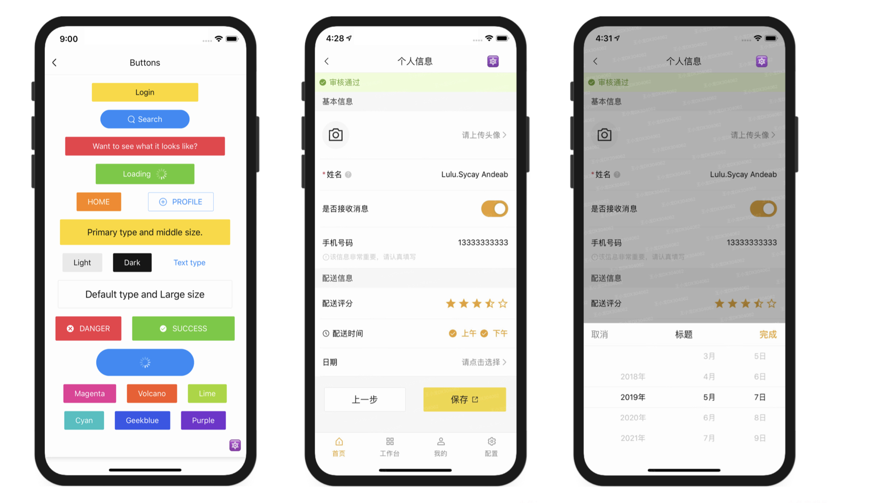
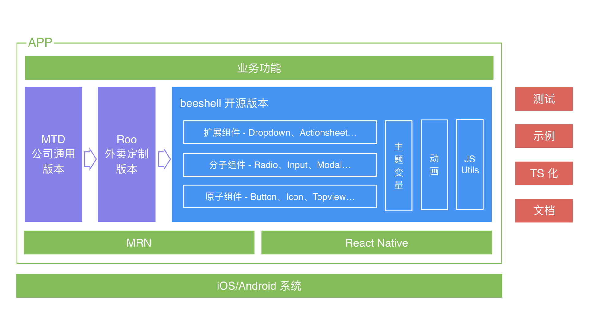
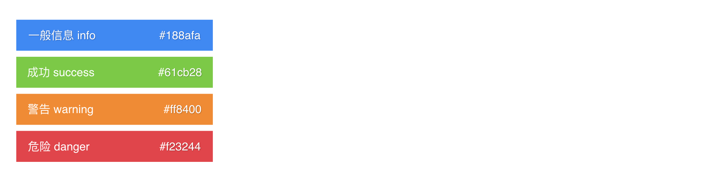
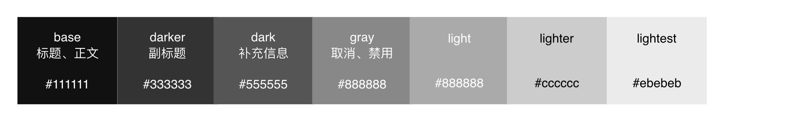
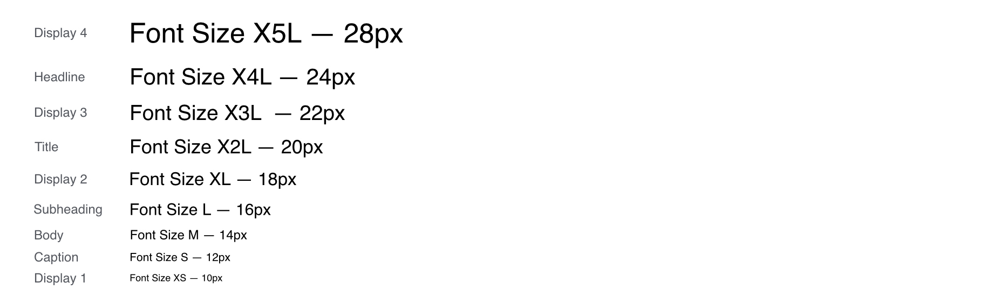
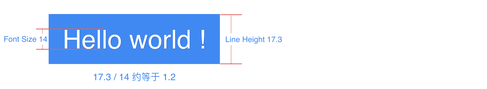
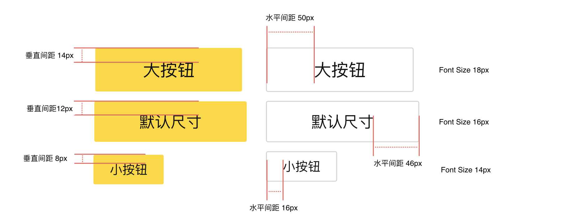
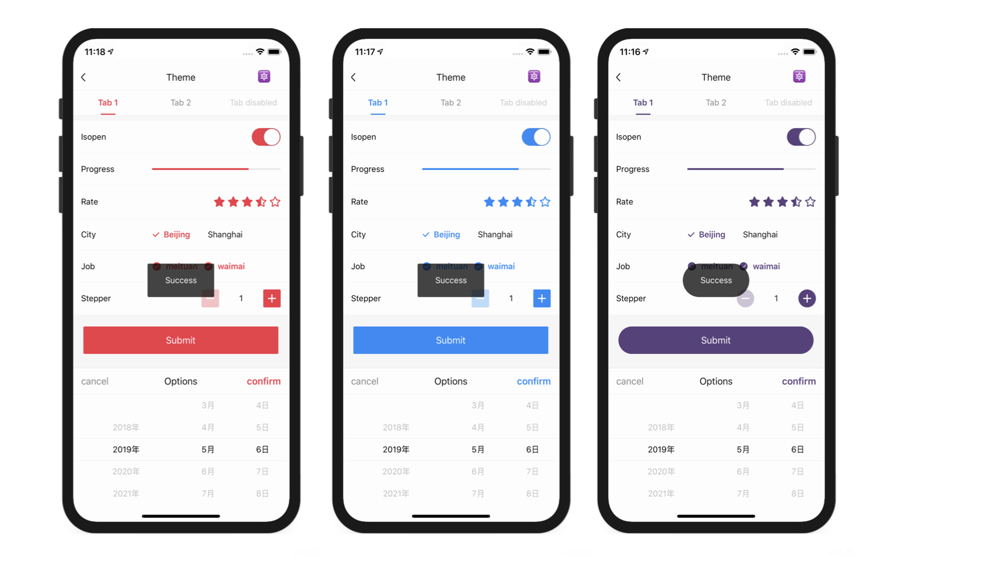

# beeshell 2.0

## 引言

2018 9 月开源，11 月内部发起 rn 组件库建设，旨在提供公司级共用的 RN 组件库，对 UI 统一、架构设计、易用性、扩展性提出更高要求

新版 beeshell 的效果图如下：

## 系统设计升级

xxxxxxxxx

业务 -> 组件库（mtd->roo->beeshell） -> mrn/rn -> iOS/Android

## 方案实现优化
### UI 风格一致性

UI 风格的一致性，包括样式一致性和动效一致性。

#### 样式一致性

样式一致性，又可以细分为色彩和排版。

首先，介绍下色彩部分。在 APP 应用中，色彩元素扮演的角色仅次于功能。 人与计算机的互动，主要是与图形用户界面（GUI）的交互，而色彩在该交互中起着关键作用。 它可以帮助用户查看和理解 APP 内容，与正确的元素互动，并了解相关操作。每个 APP 都会有一套配色方案，并在主要区域使用其基础色彩。

正因为有无数种色彩组合的可能，在设计一个 APP 时，人们的配色方案也有无数种选择。本文不纠结于如何选择一个好的配色方案，而是介绍一个配色方案应该具有哪些元素。

一套完整的配色方案，应该包括品牌主色、品牌功能色、中性色。本文以 beeshell 的配色方案举例说明。

*色彩：品牌主色*

品牌主色应该是应用中出现最频繁的颜色，通常用来强调 UI 中的关键部分的颜色。beeshell 的品牌主色色值为 `#fecb2e`，如下图所示：

有时，一个品牌主色并不能够支撑所有的应用场景，此时，可以通过加深或者变浅主色的方式，再增加几个色值，beeshell 的品牌主色还包括一个加深的色值 `#ffa000`，用于某些组件的激活状态，如下图所示：

*色彩：品牌功能色*

功能色的内容与使用场景如下图所示：

*色彩：中性色*

中性色（灰度）的内容与使用场景如下图所示：

然后，介绍排版，排版包括字体、间距、边线。

*排版：字体*

beeshell 的字体尺寸集，是基于 12、14、16、20 和 28 的排版比例，如下图所示：

对于字重，只使用正常 `normal` 和加粗`bold` 两种，避免了因为不同字体家族，对字重的支持范围不同，而导致视觉差异。

除了字体尺寸和字重，影响排版的还有字体行高。为了达到适当的可读性和阅读流畅性，字体行高，需要根据字体的大小和粗细来设定。经过测试，RN 应用在默认情况下， 行高约等于字体大小乘以 1.2，如下图所示：

> 注意：对于中文字体，行高与字体尺寸的比例并不是 1.2。

*排版：间距*

间距是 UI 元素与元素之间、父元素与子元素之间的空白区域，一个应用排版风格一致性，很大程度取决于间距。一个组件的最终宽高，应该由内容、内边距决定，而不应该直接定义宽高。

对于同一个 APP，间距应该在一个合适的范围取值，通过定义『小号间距』、『中号间距』、『大号间距』等来划分信息层次。beeshell 的 Button 组件，有三种尺寸，实现如下图所示：

*排版：边线*

边线（边框）部分，需要统一元素的边框宽度、颜色和圆角，边线虽然对 UI 风格的影响较小，但是不可或缺。beeshell 使用的边框宽度为一个物理像素，使用 RN 提供的 `StyleSheet.hairlineWidth` 接口实现；定义了三种灰度的边框颜色；主要使用 2px 的圆角。

#### 动效一致性

动效展示了应用的组织方式和功能。

动效可以：

- 引导用户在视图中的视觉焦点
- 提示用户完成手势操作后会发生什么
- 暗示元素间的等级和空间关系
- 让用户忽视系统背后发生的事情（比如抓取内容、或加载下一个视图）
- 使应用更有个性、更优雅、更令人愉悦

beeshell 组件库基于 Animated 进行了二次封装，提供 FadeAnimated 和 SlideAnimated 两个动画类，支持淡入淡出动画和滑动动画，可以使用策略模式集成到任何组件中。

beeshell 将逐渐在所有的组件集成这两种动画，保证动效的一致性，下文展示下已经实现了动画的组件，先睹为快。

Button 组件使用 FadeAnimated 类实现动画，动效如下图所示：

Modal 组件使用 FadeAnimated 类实现动画，动效如下图所示：

Dropdown 组件使用 SlideAnimated 类实现动画，动效如下图所示：

综上所述，beeshell 通过样式和动效两个方面进行 UI 一致性的优化。样式一致性的保证，主要通过定义全局性的主题变量，供所有组件使用，同时，提供了自定义主题变量的接口，可以实现一键换肤。动效的一致性，一方面，依赖主题变量中定义的动画开关变量，主要考虑到一些低端 Android 机器的性能问题，用户可以选择性关闭某个组件的动画，另一方面，依赖组件库的良好分层设计，将动画类独立实现，可以很方便的集成到任意组件中。

一键换肤的效果如下图所示：

### 定制化能力分级设计
### 功能丰富强大
### 易用性
### 功能边界清晰

# 测试
在 1.0 已经继承了黑盒测试、白盒测试，在 2.0 我们集成了灰盒测试

什么是灰盒测试？xxxx

效果图

# 开发调试
mrn

#未来规划
50+
100+

# 参考资料

- MATERIAL DESIGN：https://material.io/