# beeshell —— React Native 组件库升级 2.0


## 引言

随着 React Native（以下简称 RN）技术的出现，大前端的发展趋势已经势不可挡，跨平台技术因为其通用性、低成本、高效率的特点，逐渐成为行业追捧的热点。

为了进一步的降低开发成本，提升研发以及产品迭代的效率，公司内 RN 应用越来越广泛，随之而来，各个业务方陆续出现了对 RN 组件库的诉求。

在 2018 年 11 月左右，公司内部发起了 RN 组件库建设，旨在提供全公司共用的组件库。鉴于我们团队在开源 beeshell 1.0（建议阅读[1.0 版本推广文章](https://tech.meituan.com/2018/09/27/waimai-beeshell-popularize.html)）时，积累了丰富的经验，所以作为外卖侧的代表，加入到公司级 RN 组件库的项目共建中。在完成公司级组件库的开发后，我们决定将共建的成果贡献出来，进一步提升团队影响力。

我们以 beeshell 升级 2.0 的形式进行开源，在共建成果的基础上，经过进一步的开发与梳理，共计开源 38（33 个组件与 5 个工具）个功能，在服务社区的同时，希望借助社区的力量，进一步完善组件库。

beeshell 2.0 效果图如下：


## 背景

前端开发（包括 Web 与 Native 开发）是图形用户界面（GUI）开发的一种。随着组件化、模块化的开发方式成为主流，各种以组件化方式实现的框架（如：AngularJS、React、Vue.js 等）方兴未艾。借助这些组件化框架，前端开发这种构建用户界面的过程，本质上是：开发组件，处理组件与组件之间的组合、通信。

纵观各种 Web 以及 Native 产品的界面，我们可以发现都是由一些基本组件（控件、元素）组合而成。这样看来，如果可以实现一套通用的组件，就可以减少开发组件的工作量，进而大大降低前端开发的成本。各个业务方对 RN 组件库的诉求，目的也在于此：降低开发成本。

如何通过一套组件，来有效的支撑外卖、配送、酒旅以及其他各个事业部的所有业务需求？我们归纳总结了对组件库的要求：

- UI 风格一致性。在同一个业务中，各个组件要有一致的 UI 风格，保证用户体验、塑造品牌形象。
- 通用性。可以支持不同的业务方，可以灵活的定制不同的业务需求，最大化组件复用率，减少重复开发。
- 易用性。组件的功能、行为表现符合开发者的直观感受，易于学习和使用、减轻记忆负担；功能丰富，可以支持多种业务场景，支持特定业务场景的多种情况。
- 稳定性。RN 组件库需要同时支持 iOS、Android、Web 三个平台，组件要在三个平台稳定、可靠、可用。

简而言之，组件库的目标是通用、灵活、易用、稳定。

## 系统设计

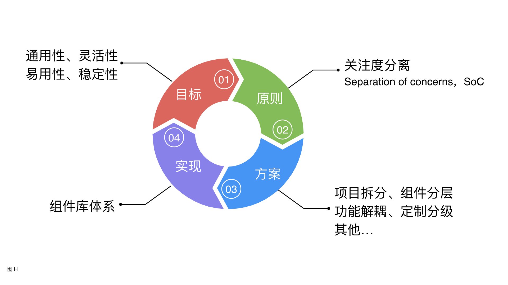

我们的目标是提供一套通用、灵活、易用、稳定的组件，然而，对一个组件来说，如果通用性、灵活性强，则易用性、稳定性势必较差。如何将两个互相矛盾的方面整合？

我们使用了“关注度分离”的设计原则，将组件库需要支持的特性合理的分解，分别仔细研究特性的不同侧面（关注点），最后综合各个方面的结果，合成整体的解决方案。

“关注度分离”的设计原则，贯穿整个组件库的设计与实现，是组件库的核心思想。以该原则为基础，衍生出了项目拆分、组件分层、功能解耦等等具体方案，实现了一个组件库体系，保证了可以兼顾到相互矛盾的两个方面，实现最终目标。

### 架构升级

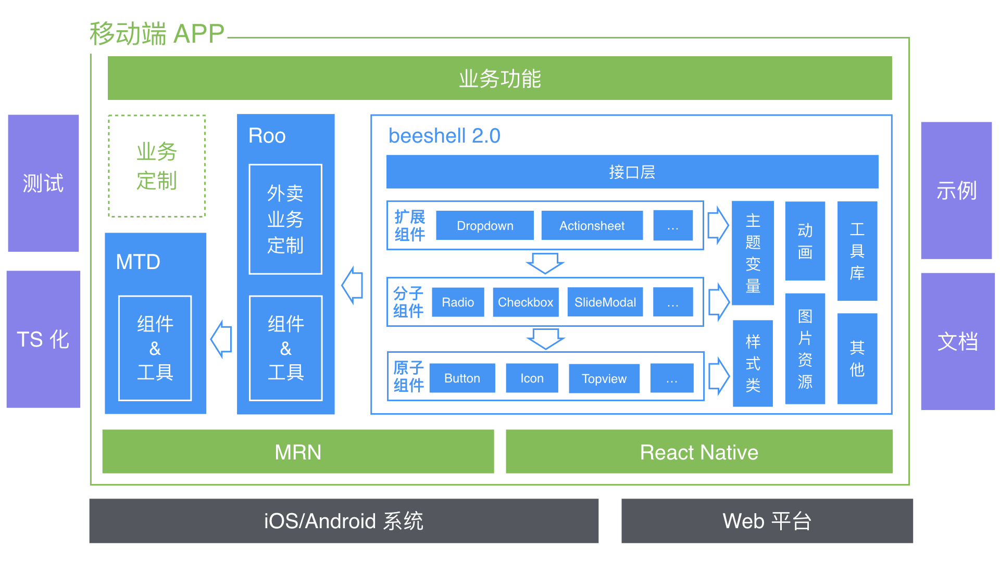


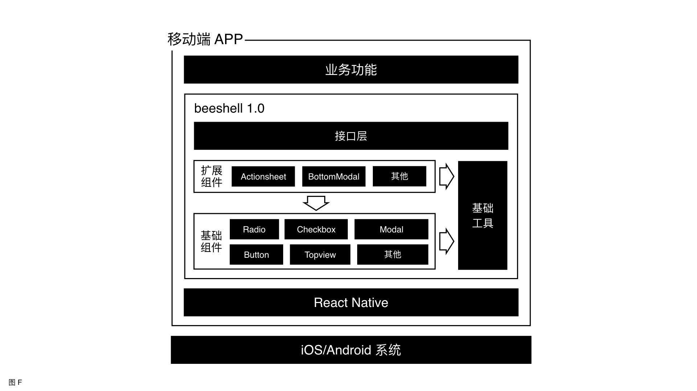

beeshell 2.0 与 1.0 的架构在整体上保持一致，共分成四层：业务层、组件库（体系）、RN 层、系统层。而 beeshell 2.0 的架构升级，则主要体现在第二层与第三层：

**第二层，组件库体系**

组件库由 1.0 的一个项目，演变成 2.0 的三个项目（版本），形成了一个组件库体系。具体包含：MTD 公司通用版本、Roo 外卖定制版本和 beeshell 开源版本。

这种项目拆分的方式，符合“关注度分离”的设计原则，三个版本有各自不同的关注点：

- MTD 的关注点是通用性、灵活性，所以提供的是基础的、通用的组件，组件的扩展能力极强，可以满足多个业务方的定制化需求。
- Roo 是对 MTD 的继承与扩展，定制了外卖业务的 UI 风格与功能，通用性减弱，功能性和业务性增强，关注易用性、业务性、一致性。
- beeshell（准确的说是 2.0 版本）是对 Roo 的继承与扩展，与 Roo 相比，去除了过于业务化的组件与功能，纳入并整合社区的需求，关注通用性、易用性、稳定性。

组件库体系的三个版本，内部的架构设计一致，本文只详细介绍 beeshell 开源版本。组件库使用了分层的架构风格，分成了接口层、组件层、工具层以及三端适配。

- 接口层。汇总所有组件，统一输出，使用全部引入的方式，方便组件使用。另外，为了避免引入过多无用组件，引起资源包过大，也支持组件的按需引入。
- 组件层。细分为原子、分子、扩展组件。    
  与 beeshell 1.0 相比，我们对组件在更细的粒度上，进行拆分，同时，层次划分也更加精细、明确。这样，使得组件的继承、组合方式更加灵活、多变，可以更加充分的利用继承与组合，最大化代码复用。而且，原子、分子、扩展组件，各层次组件各司其职，“关注度分离”，兼顾通用性和易用性。
- 工具层。与 beeshell 1.0 相比，工具更加完备。新增了树形结构处理器、校验器等。工具的独立性更强，与组件完全解耦，与组件配合实现功能。    
  这样，一方面，使得组件实现更加简洁，提升了组件的可维护性；另一方面，可以将工具提供给用户，方便用户开发，提升组件库的功能性、易用性。而且，工具与组件的解耦遵循“关注度分离”的原则。
- 三端适配。RN 在整体上实现了跨平台，iOS、Android、Web 三端使用一套代码，但是在一些细节方面，例如：特殊 API 的支持、相对位置计算等，各个平台有较大差异。为了更好的支持三端，保证跨平台稳定性，还需要在这一层做很多适配工作。

**第三层，RN 层**

这一层新增了 MRN，MRN 是对 RN 的二次封装，与 RN 底层实现保持一致。组件库在两个平台的表现一致。

> MRN 是基于开源的 RN 框架改造并完善而成的一套动态化方案。MRN 从三个方面弥补 RN 的不足：

> - 动态化能力。RN 本身不支持热更新，MRN 借助公司内发布平台，实现包的上传发布、下载更新、下线回滚等操作。

> - 双端（未来三端）复用问题。从设计原则上要保证，开发者对平台的差异无明显感知。

> - 保障措施。在开发保障方面：提供脚手架工具、模版工程、开发文档等，方便开发者日常的 MRN 开发工作。提供多级分包机制，业务内部和业务之间能够灵活组织代码；在运行保障方面：提供运行环境隔离，使得不同业务之间页面运行无干扰。提供数据采集和指标大盘，及时发现运行中的问题。提供降级能力应对紧急情况。


除此之外，整个组件库体系，包含更加完善的测试方案；丰富的代码示例；使用 TypeScript（以下简称 TS）语言进行开发，充分利用 TS 的类型定义与检查；针对每个组件都有详细的文档说明。最终，提供一套通用性、易用性、稳定性、扩展能力都更强的高质量组件。


### 协作模式

这里通过结构和流程两个方面，详细介绍 beeshell 1.0 与 beeshell 2.0 以及 MTD、Roo 的关系。

三个版本之间通过 Git Fork 建立依赖关系，使用源码依赖的方式实现项目拆分。对于用户而言，不同版本的相同组件，底层依赖与实现都是一致的。

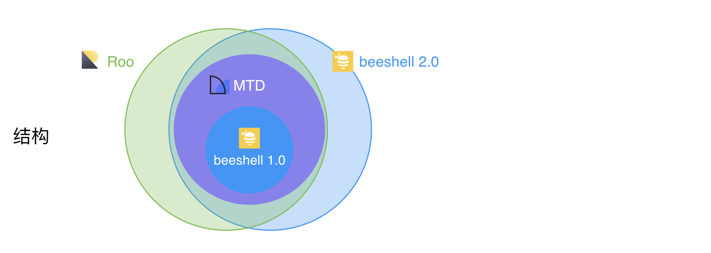

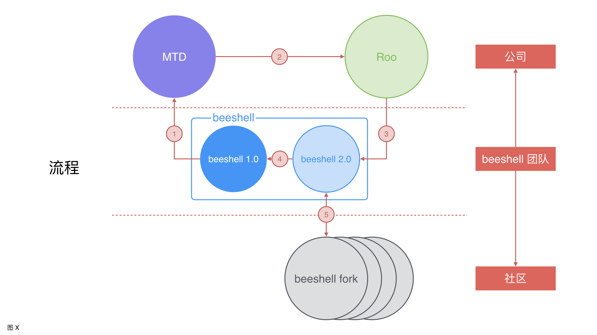


结构方面：MTD 包含 beeshell 1.0 的全部内容，并进行了组件数量的扩充、组件功能的增强；Roo 包含 MTD，进行了定制与业务扩展；beeshell 2.0 与 Roo 基本一致，去除业务部分，纳入社区需求。

流程方面：

- 首先，我们在 beeshell 1.0 的开发以及开源中，积累了丰富的经验。在建设 MTD 公司通用版组件库时，贡献了 50% 的组件，同时，为共建贡献了许多设计模式与思路，大大加速了组件库的建设。
- 然后，在 MTD 建设完成后，我们为了更加方便、快速的接入外卖的相关业务，以 MTD 为基础，定制了外卖主题的组件库 Roo，提升了组件库的业务功能性和易用性。外卖相关的业务项目，在接入 Roo 后直接使用，无需再进行主题的定制与调整，在一定程度上节省开发成本。
- 最后，我们将共建的成果贡献出来，以 Roo 为基础，升级 beeshell 2.0 并开源。将部分过于业务化的组件移除，纳入整合了社区的相关需求，保证组件库的通用性、易用性与稳定性。

以 beeshell 开发团队为桥梁，建立了公司与开源社区的交流互通的关系，公司与 beeshell 团队以及社区，可以互帮互助，共同建设、进步。

## 方案实现
### UI 风格一致性

UI 风格一致性的重要性在于，对内可以保持平台统一性、提升团队效率、打磨细节体验；对外塑造品牌形象、减轻用户学习成本、保持产品的体验一致性。

UI 风格一致性的关键要素，包括色彩、排版、字体、图标以及交互操作等。可以归纳为：样式一致性和动效一致性。

beeshell 延用了 Roo（袋鼠 UI）的 UI 设计规范，其内容涵盖了 PC 端与移动端、Web 平台与 RN 平台，对 UI 与交互给出了详细的视觉规范，旨在保证外卖事业部，全部产品的 UI 一致性。UI 规范的技术实现方式如下：

<!--  -->

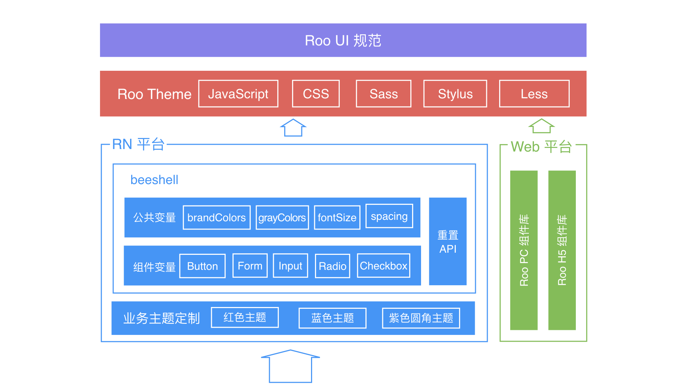

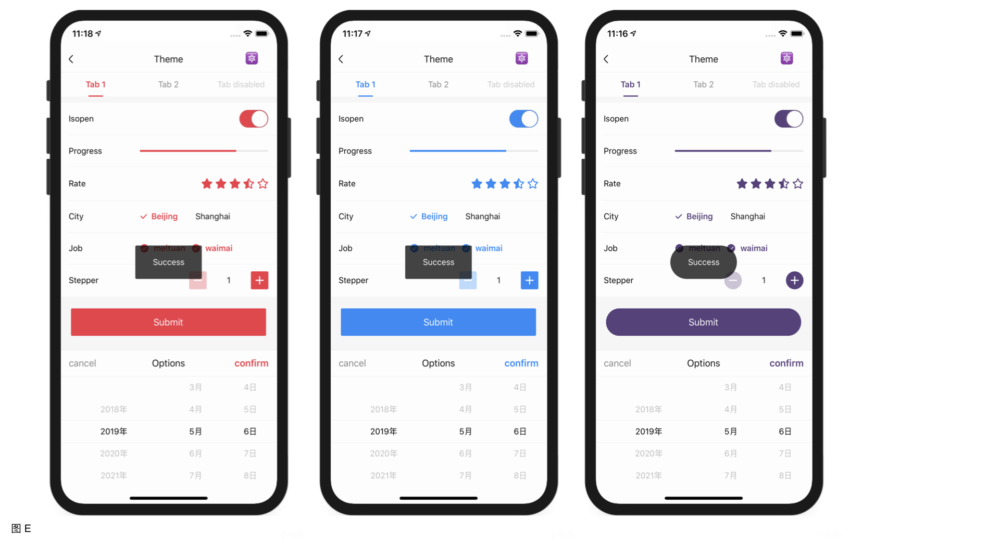

Roo Theme 向上实现了 UI 规范具体内容，将设计规范统一收敛，向下输出主题变量、组件样式类、通用样式工具等，供各个组件库以及业务方使用。

Roo Theme 主要使用 Sass 预处理器实现，提供了各个组件的统一样式类，而为了满足不同技术栈的需求，主题变量的输出，提供了 JavaScript（以下简称 JS）、CSS、Less、Sass、Stylus 多种语言，不同平台、技术栈可以根据情况自由选择。

beeshell 基于 Roo Theme 输出的 JS 主题变量，通过样式和动效两个方面，保证了 UI 一致性。

- 样式一致性的保证。通过继承、扩展 Roo Theme，定义了全局性的主题变量，用于组件的样式部分定义。主题变量范围，涉及品牌色、灰度、字体尺寸、间距以组件级变量，为组件以及组件之间样式一致性，提供了全面的保障。同时，组件库提供了自定义主题变量的接口，可以重置相关变量的值，实现一键换肤，UI 风格进行一致性调整。另外，使用“内部样式 < 主题 < 扩展样式”的样式优先级覆盖策略，保证了样式部分的定制能力（在下文“定制化能力分级设计”章节中详细介绍）。

- 动效一致性的保证。一方面，依赖主题变量中定义的动画开关变量，主要考虑到一些低端 Android 机器的性能问题，用户可以选择性关闭某个组件的动画；另一方面，依赖组件库的良好分层设计，将动画类独立实现，可以使用策略模式，方便的集成到任意组件中。

下文详细介绍样式一致性和动效一致性：

#### 样式一致性

样式一致性，可以从色彩和排版两个方面来保证。

首先，介绍下色彩部分。在 APP 应用中，色彩元素扮演的角色仅次于功能。人与计算机的互动，主要是与图形用户界面的交互，而色彩在该交互中起着关键作用。它可以帮助用户查看和理解界面内容，与正确的元素互动，并了解相关操作。每个 APP 都会有一套配色方案，并在主要区域使用其基础色彩。

正因为有无数种色彩组合的可能，在设计一个 APP 时，人们的配色方案也有无数种选择。本文不纠结于如何选择一个好的配色方案，而是介绍一个配色方案应该具有哪些元素。

一套完整的配色方案，应该包括品牌主色、品牌功能色、中性色。本文以 beeshell 的配色方案举例说明。

*色彩：品牌主色*

品牌主色应该是应用中出现最频繁的颜色，通常用来强调 UI 中的关键部分的颜色。beeshell 的品牌主色色值为 `#ffd800`，如下图所示：


通常，一个产品的 UI 只会有一个品牌主色。然而，像 beeshell 这种品牌主色的色值较浅的情况，一个品牌主色并不能够支撑所有的应用场景。此时，可以通过加深主色的方式，再增加几个色值，beeshell 的品牌主色还包括一个加深的色值 `#ffa000`，用于某些组件的激活状态，如下图所示：


对于品牌主色的个数，需要根据色值的情况而定，不必过于拘泥规则，只要能有一致性的用户体验即可。

*色彩：品牌功能色*

beeshell 的功能色的内容与使用场景如下图所示：


这四个色值，分别用于一般信息、成功、警告、失败这四种业务场景，以及从这四种业务场景所衍生出的场景，在一定程度上，保证色彩的一致性。

*色彩：中性色*

beeshell 的中性色（灰度）的内容与使用场景如下图所示：


中性色应用于界面主体文本的颜色，灰度范围的确定，可以大大提升色彩的一致性。

然后，介绍排版，排版又包括字体、间距、边线。

*排版：字体*

beeshell 的字体尺寸（Font Size）集，是基于 12、14、16、20 和 28 的排版比例，如下图所示：


这样的排版比例，可以使得界面的文字内容更加协调、流畅，进而提升了排版的一致性。

对于字重（Font Weight），beeshell 只使用正常（normal）和加粗（bold）两种：normal 用于一般文本；bold 用于强调，吸引用户注意力。只使用这两种字重，也避免了因为不同字体家族（Font Family），对字重的支持范围不同，而导致视觉差异。

除了字体尺寸和字重，影响排版的还有字体行高（Line Height）。为了达到适当的可读性和阅读流畅性，可以根据字体的大小和粗细，设定字体行高。默认情况下，RN 应用：行高 = 字体大小 * 1.2。如下图所示：


beeshell 使用了默认的字体行高，在一定程度保证了可读性和排版的一致性。

*排版：间距*

间距是 UI 元素与元素之间、父元素与子元素之间的空白区域，一个应用排版风格一致性，很大程度取决于间距。一个组件的最终宽高，应该由内容、内边距以及边框决定，是自适应的，而不应该直接定义宽高。

对于同一个 APP，间距应该在一个合适的范围取值，可以通过定义『小号间距』、『中号间距』、『大号间距』等来划分信息层次。例如 beeshell 的 Button 组件，有三种尺寸。实现效果如下图所示：


*排版：边线*

边线（边框）部分，需要统一元素的边框宽度、颜色和圆角，边线虽然对 UI 风格的影响较小，但是不可或缺。beeshell 使用的边框宽度为一个物理像素，使用 RN 提供的 `StyleSheet.hairlineWidth` 接口实现；定义了三种灰度的边框颜色；主要使用 2px 的圆角。

最后，样式的一致性，还涉及到图标、布局等相关内容，因为 beeshell 对这些内容的涉及较少，这里不做详细介绍。

#### 动效一致性

动效展示了应用的组织方式和功能。

动效可以：

- 引导用户在视图中的视觉焦点
- 提示用户完成手势操作后会发生什么
- 暗示元素间的等级和空间关系
- 让用户忽视系统背后发生的事情（比如抓取内容、或加载下一个视图）
- 使应用更有个性、更优雅、体验更加一致

beeshell 组件库基于 Animated 进行了二次封装，提供 FadeAnimated 和 SlideAnimated 两个动画类，支持淡入淡出动画和滑动动画，可以使用策略模式集成到任何组件中。

beeshell 将逐渐在所有的组件集成这两种动画，保证动效的一致性，下文展示下已经实现了动画的组件，先睹为快。

Button 组件使用 FadeAnimated 类实现动画，动效如下图所示：


Modal 组件使用 FadeAnimated 类实现动画，动效如下图所示：


Dropdown 组件使用 SlideAnimated 类实现动画，动效如下图所示：


### 定制化能力分级设计

要开发一套全公司共用的组件，需要同时满足酒旅、外卖 C 端、外卖 B 端以及外卖 M 端等业务的需求，这对组件的定制化能力提出了更高的要求。

为了进一步增强组件的定制化能力，提升组件的通用性、灵活性，同时，避免属性（API）的无节制增加，进而导致组件难以维护，我们设计了定制化能力分级的策略。

这里以一个常见的业务场景：底部上滑弹框，来举例说明分级设计。

<!--  -->

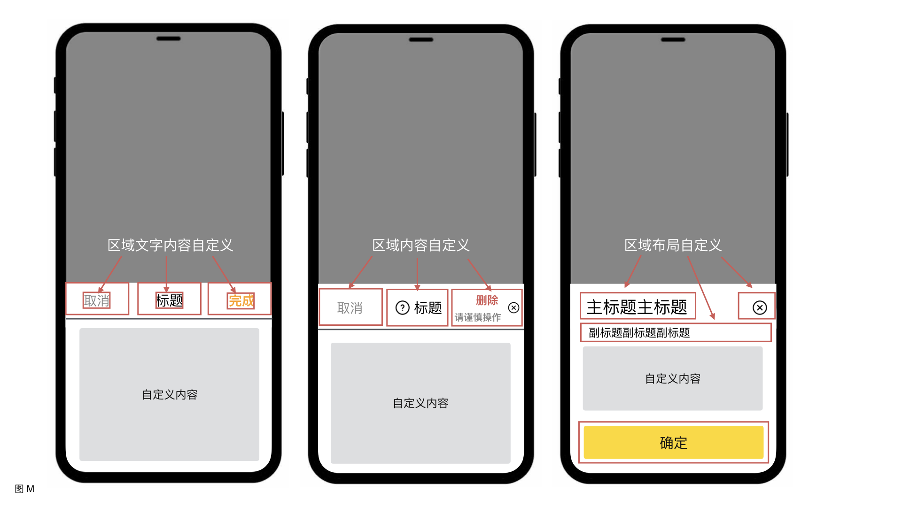

如上图所示：第一个例子比较通用、规范，“区域文字内容”的文案与样式需要支持自定义；第二个例子，需要支持多行文字以及图标，即“区域内容”需要支持自定义；第三个例子，自定义的重点，由区域以及区域内部，转移到区域之间的布局，“区域布局”需要支持自定义。

区域文字内容、区域内容、区域布局，三个层面的灵活性，可以涵盖一个业务场景，所有定制化需求了。以当前业务场景为例，来讲解如何使用定制化能力分级设计，完成全部的定制化需求。

首先实现了一个 BottomModal 底部弹框组件，然后开始进行定制化设计：

#### 第一级定制化，定制主题变量

“完成”文本的颜色，使用的是主题变量定义的品牌主色（Brand Primary Dark），beeshell 默认的品牌主色为黄色。

通过组件库提供的自定义主题变量的接口，可以修改品牌主色的色值，进而修改了“完成”文本的颜色。“取消”、“标题”的颜色修改同理。

修改品牌主色，影响范围很大，所有组件的色彩风格统一变化，如果我只想把文本的颜色改成红色，但是并不想修改品牌主色，应该如何定制呢？可以使用第二级定制化。

#### 第二级定制化，提供定制属性

这里提供 labelText（类型为 string）和 labelTextStyle（类型为 TextStyle）属性，如下图所示：


代码实现为：

```
<Text style={this.props.labelTextStyle}>{this.props.labelText || '完成'}</Text>
```

labelText 用于定制文案内容，将 labelTextStyle 整体暴露出来，而不是只暴露颜色单个属性，这样的好处有两点：

- 开发者都熟悉 style 这个名称与用法，但并不知道 xxxColor 是什么，组件更加易用。
- style 不仅可以定制 color，还支持 fontSize、fontWeight 等属性，定制能力更强。

以上两级主要是样式部分的定制，使用了样式优先级覆盖的策略，扩展样式（labelTextStyle）覆盖主题，主题覆盖内部样式。

下一步，就是对于多行文字、图标的支持。


#### 第三级定制化，开放渲染区域

提供 label 属性，类型为 ReactElement 对象，任意定制 UI，如下图所示：


到这里，区域以及区域内部的定制化需求，就都可以满足了，但是区域布局的定制化，因为布局情况太多，并不容易实现。


如果再提供几个属性，用于定制布局方式、头部边框样式、底部按钮，按照这种方式，属性会无节制增加，势必造成组件难以维护，易用性也会大打折扣。那应该如何实现？我们设计了第四级。

#### 第四级定制化，继承/组合基类

在 beeshell 1.0 的开源推广文章中也有讲到过，我们在组件库开发之初，对常见组件，进行了全面的梳理，在比较细的粒度，对组件进行拆分，以继承的方式，层层依赖，以功能渐进式增强的方式，实现各个组件。

这样使得开发者，可以在任意层级上继承、组合组件，进行定制化开发，提供了极强的扩展能力。具体实现如下：

首先，组件库实现一个 SlideModal 滑动弹框组件，这是一个比较底层、基础的组件，功能相对少，支持多个方向的滑动动画，内容完全由开发者自定义，通用性、定制化能力极强。实现效果如下：


然后，组件库实现了 BottomModal 组件，继承 SlideModal，固定滑动的方向和开始位置，弹框内容横向拉伸至全屏、纵向自适应，功能增强而定制化能力减弱。实现效果如下：


前文已经讲到，产品需求已经超出了 BottomModal 定制化的能力，强行实现只会带来不良后果。所以，我的方式是组合使用 SlideMdoal，开发一个新的组件，也就是第四级定制化。新组件的实现效果如下：


第四级定制化，是使用了新的思路，不再盲目的增加一个组件的功能，来帮助开发者满足产品需求，而是提供了基础工具，基础工具实现了底层、复杂的部分，表现层的部分则让渡给开发者，用户自己实现，“授人以鱼不如授人以渔”。

对比业界的开源 RN 组件库，也没有几个可以达到第四级的定制化能力。

beeshell 通过四个级别的定制化的能力，可以轻松搞定所有的产品的需求。


总之，定制化能力分级设计，是对定制化需求进行分类，针对每一类的定制化需求，设计了相应的策略，最终合成一个完整的解决方案，符合“关注度分离”的设计原则。

### 功能丰富

功能丰富旨在支持多种的业务场景，支持特定业务场景的多种情况，进而提升组件库的易用性。功能丰富通过两个方面保证：组件丰富度，单个组件的功能丰富度。

#### 组件丰富度

为了保证组件丰富度，我们通过多种渠道（既有组件整理、业务组件提取、参考标杆项目）来收集组件。最终规划了包括通用类、导航类、数据录入类、数据展示类、操作反馈类、基础工具在内的 6 个大类，共 50+ 功能，旨在覆盖尽可能多的业务场景。

目前，beeshell 已经实现了 38 个功能，与业界标杆项目的对比情况如下图：

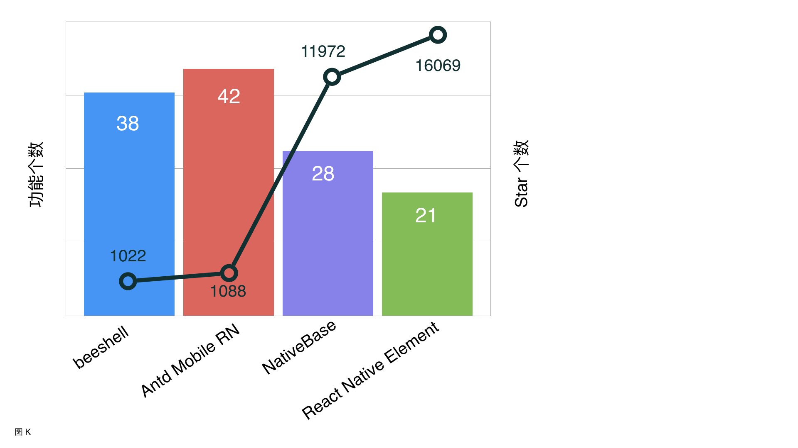

虽然，beeshell 的组件数量还比不上 Antd Mobile RN（用不了多久也会超过），但是，已经超过 NativeBase 和 React Native Element，在组件数量上有很大优势，可以支持更多的业务场景。而且，支持全部引入和按需引入，用户无需担心打包过多无用代码的问题。

#### 功能丰富度

功能丰富度针对的是单个组件所支持的功能，旨在覆盖特定业务场景的多种情况。

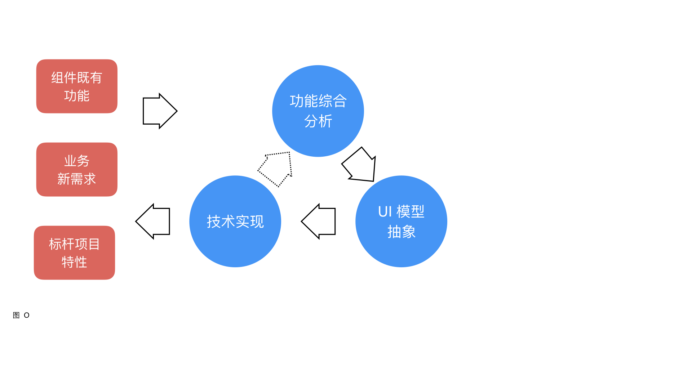

对于一个组件的功能丰富度，我们通过多方式收集、功能综合分析、UI 模型抽象、技术实现、验证反馈几个步骤来保证。

- 多方式收集。通过多种方式来收集组件功能，收集方式包括：组件既有功能、业务新需求、标杆项目特性。
- 功能综合分析。对收集的功能进行全面、综合分析与考虑，得出组件需要支持的功能特性。
- UI 模型抽象。对组件功能进行抽象设计，根据 UI 模型，明确抽象设计的合理性和有效性。
- 技术实现。根据平台特性、技术选型来完成代码实现。
- 验证反馈。组件实现后，会应用到业务或者示例工程来验证，如果组件并不能满足需求，需要重复执行以上几步。

下文以 SlideModal 组件的实现，举例说明：

首先，通过多种方式，收集到的滑动弹框的场景如下：

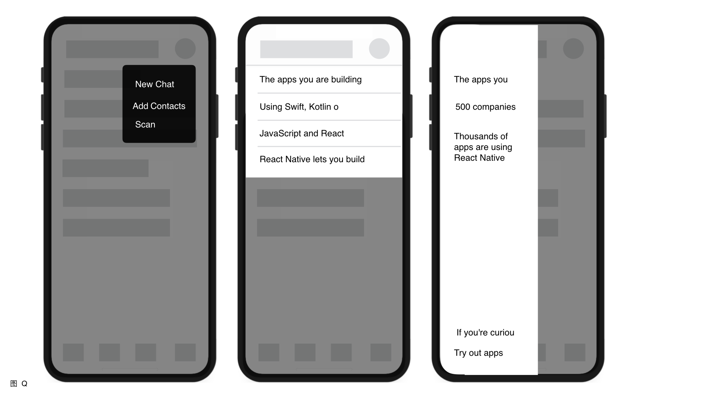

其次，综合分析得出，SlideModal 组件需要支持的功能有：弹出位置自定义、滑动方向自定义、全屏/半屏自定义。

然后，进行 UI 模型抽象，抽象设计如下图所示：


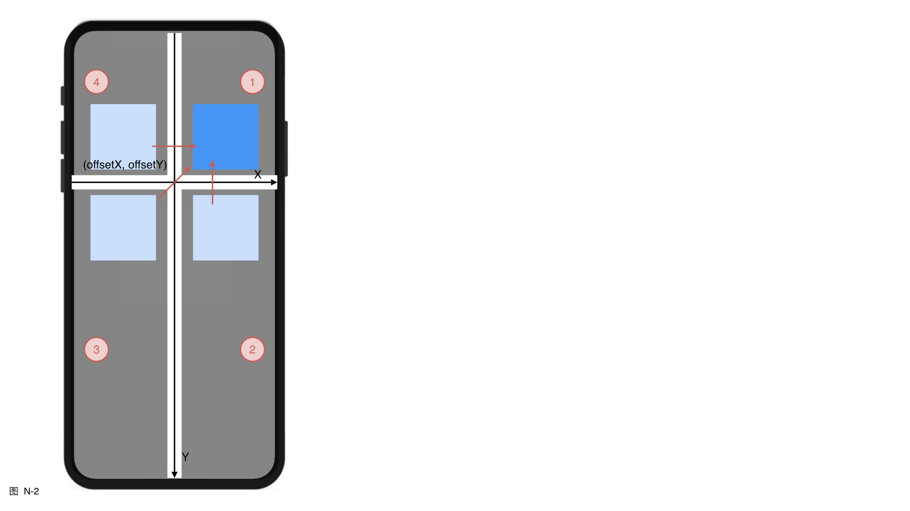

由 UI 模型得出，SlideModal 组件通过 (offsetX, offsetY) 坐标值来定义弹出位置；为了支持全屏/半屏效果，将屏幕分割为 4 个区域，分别自定义触控效果（阻断点击或者击穿）；弹框内容在一个区域展示，每个区域有 3 种滑动方向（图 N-2），共支持 12 种滑动动效。

最后，是基于 RN 平台的技术实现，并经过了大量业务场景的验证反馈。SlideModal 组件的最终实现效果如下：


对比业界开源 RN 组件库，针对滑动弹框场景，没有几个可以超过 SlideModal 的业务支持能力。

SlideModal 组件只提供底层支持，如果要应用到真实的业务场景，还需要基于该组件进一步开发。beeshell 也提供了更高层次的定制组件，例如：Dropdown、Popover 等，可以直接使用。

除了 SlideModal 之外，还实现了其他功能强大的组件：Slider 滑块组件，支持纵向和横向滑动；Rate 评分组件，实现一套滑动评分的机制，支持定制任意 UI 元素。由于篇幅有限，在此不再赘述。

### 易用性提升

组件易用性的提升，通过命名、文档和示例这三个方面来保证。

#### 命名

命名包括组件名、属性与方法名。

一个组件，实际上就是 Web 页面或者 APP 中的元素、控件，通常因为原生控件的能力薄弱，而进行二次封装，所以组件名与原生控件名的名称，尽量保持一致。例如，Form 与 HTML form 标签一致，Switch 从 iOS 控件 UISwitch 中得来。这样的命名，可以给与开发者更加直观的感受，通过名称就能知道组件大概的 UI 与功能，降低学习和使用的成本。

属性与方法的命名，既要考虑原生控件的属性名，又要考虑组件库命名的一致性。例如，表单录入的相关组件，包括 Input、Radio、Checkbox、Switch 等，组件的值要统一使用 value 命名，值变化的回调使用 onChange，选中状态使用 checked 布尔类型。这样符合用户的直观感受，更加易用，降低使用成本。

常用属性名举例如下：

| 属性名 | 类型 | 描述 |
| ---- | ---- | ---- |
| style | ViewStyle/TextStyle | 组件样式，通常作为组件的第一个子节点的样式属性 |
| data | any[] | 数据源，数据源的元素通常是对象 `{ label: string, value: any, [props: string]: any }` label 作为展示文案，value 作为元素唯一标志，以及其他属性 |
| value | any | 值 |
| onChange | Function | 值变化回调 |
| onPress | Function | 点击事件 |
| renderItem | Function | 自定义渲染项 |

#### 文档

文档规定了统一的格式，旨在全方位介绍组件，方便开发者使用，格式内容如下：

- 组件名称。
- 组件描述。
- 引入方式，包括全部、按需两种引入方式。
- 示例演示，动图与静图。
- 示例代码，使用伪代码，言简意赅，能说明使用方式即可，同时，附有完整示例代码的链接。
- API 说明，分成 Props 和 Methods 两部分。
    - Props 包含 Name | Type | Required | Default | Description。
    - Methods 格式借鉴 RN 官方文档格式。

#### 示例

beeshell 组件库遵循“关注度分离”的设计原则，对组件进行了细粒度的拆分，进行了分类、分层，以及基础工具与组件实现的功能解耦。

这些设计虽然大大提升了组件库的灵活性，但是在一定程度上，对开发者提出了更高的要求，开发者需要理解各个组件与工具，灵活的组合各个元素，才能更好的完成业务需求。

为了方便开发者，更有效、合理的使用组件，我们将会实现一些经典的业务场景，以示例的形式开源出来，借助公司的平台服务，为用户提供在线演示的功能，用户可以下载美团 APP（iOS 与 Android 都可以），扫描下图二维码，即可快速体验各种应用场景。


## 测试

代码开发的目的有两个：第一个是实现需求，第二个是保证研发质量。研发质量对公共组件库来说，尤为重要。测试是为了提高代码质量和可维护性，是实现代码开发第二个目标的一种方法。

beeshell 1.0 中已经集成了“黑盒测试”与“白盒测试”。beeshell 2.0 在原有的基础上，进行了一定程度的优化，代码的可靠性与安全性，仍然保持最高级别，而测试覆盖率则由原来的 70% 提升到了 80% 以上，使用 SonarQube 的分析统计结果如下图：


不仅如此，beeshell 2.0 在测试领域继续探索，集成了“灰盒测试”（基于开源方案 Detox 实现）。

> 灰盒测试，是介于白盒测试与黑盒测试之间的一种测试，灰盒测试多用于集成测试阶段，不仅关注输出、输入的正确性，同时也关注程序内部的情况。灰盒测试不像白盒那样详细、完整，但又比黑盒测试更关注程序的内部逻辑，常常是通过一些表征性的现象、事件、标志来判断内部的运行状态。

灰盒测试效果如下图所示：


通过黑盒测试、白盒测试、灰盒测试，三种测试方案，更加全面的保证组件库的代码质量，大大提高了代码可维护性。


## 开发调试

受益于 MRN 平台，JS 代码与 Native 代码得以完全分离。

beeshell 源码工程，包含了包括组件源码、示例代码、测试文件在内的全部 JS 代码，Native 部分则只负责打包生成容器（本文以美团 APP 举例说明），通过下载并安装 .app（iOS）或者 .apk（Android） 文件至模拟器，直接加载本地服务提供的 jsbundle，快速进入开发调试。

前端开发再也不用关心 Native 的部分，无需耗时耗力的维护 Native 环境、依赖，极大降低了前端开发成本。开发调试流程如下图所示：


## 未来规划

我们的目标是把 beeshell 建设成为一个全面且完备的组件库，不仅会不断丰富 JS 组件，而且会不断加强复合组件去支持更多的底层功能。

我们为组件库发展规划了三个阶段：

- 第一阶段，beeshell 1.0 版本，开源 20+ 组件，主要提供基础功能。
- 第二阶段，对我们在开发 React Native 应用几年时间积累的组件进行整理，同时参考业界的标杆项目，开源 50+ 组件。
- 第三阶段，调研移动端 APP 常用的功能与场景，分析与整理，然后在 beeshell 中实现，开源 100+ 组件。

此次 beeshell 2.0 升级，共计开源 38 个功能，而且已经详细的规划了另外的 15+ 组件，也会在近期开源，目前处于第二阶段的收尾阶段。

第三阶段的建设，也在紧锣密鼓的筹备当中，要实现 100+ 组件任务十分艰巨，希望大家踊跃参与，共同建设。

## 开源相关

### Github 地址

[beeshell](https://github.com/Meituan-Dianping/beeshell)

### 核心贡献者

[小龙](https://github.com/wxlworkhard)，[泽楠](https://github.com/weirDozzz)，轶超，宋鹏，[孟谦](https://github.com/mactive)


## 参考资料

- [beeshell 1.0 开源推广文章](https://tech.meituan.com/2018/09/27/waimai-beeshell-popularize.html)
- [MATERIAL DESIGN](https://material.io/)
